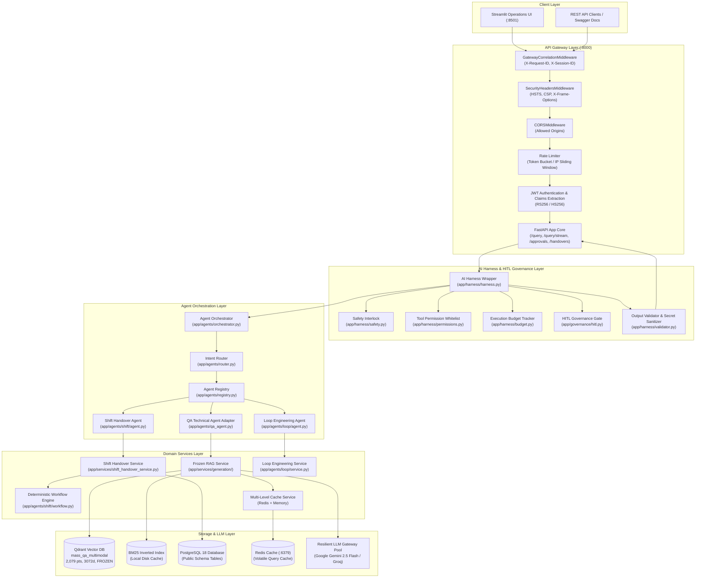
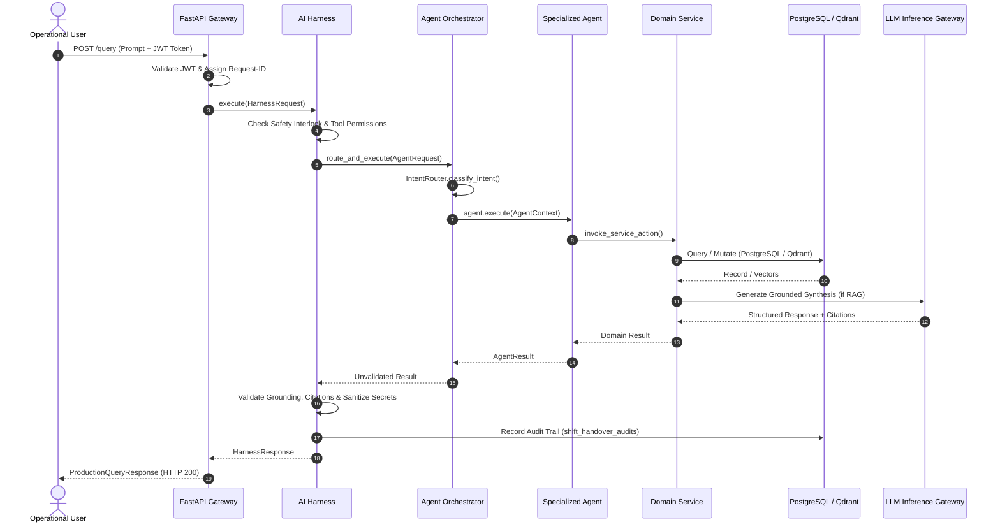

# 01. MASS QA & Shift Handover Platform — System Architecture

## 1. Purpose & Scope

This document provides the definitive architectural blueprint for the **MASS QA & Shift Handover Multi-Agent Platform**. It details every subsystem layer, communication interface, failure containment boundary, security boundary, and data boundary across the entire application stack.

---

## 2. End-to-End System Topology

---

## 3. Detailed Subsystem Layers

### 3.1 Transport & API Gateway Layer
- **Location**: [`app/main.py`](file:///d:/Chatboat/app/main.py), [`app/security/middleware.py`](file:///d:/Chatboat/app/security/middleware.py)
- **Responsibilities**:
  - Intercepts all incoming HTTP requests and assigns unique `X-Request-ID` and `X-Session-ID` correlation identifiers.
  - Applies strict security response headers (`Content-Security-Policy`, `X-Content-Type-Options: nosniff`, `X-Frame-Options: DENY`, `Strict-Transport-Security`).
  - Decodes and cryptographically verifies JWT Bearer tokens, injecting user claims (`user_id`, `role`, `session_id`) into `request.state`.
  - Enforces sliding-window IP rate limiting to protect LLM endpoints from abuse.
  - Serves Server-Sent Events (SSE) via `/query/stream` for real-time token streaming.

### 3.2 AI Harness & Governance Layer
- **Location**: [`app/harness/`](file:///d:/Chatboat/app/harness/), [`app/governance/`](file:///d:/Chatboat/app/governance/)
- **Responsibilities**:
  - **Pre-execution Safety Interlock**: Intercepts physical equipment control commands (e.g. `trip compressor`, `open valve`, `bypass ESD`) and raises `PHYSICAL_CONTROL_PROHIBITED`.
  - **Tool Permission Matrix**: Enforces strict capability whitelists per role and agent (`ToolPermission.REMOTE_EQUIPMENT_CONTROL` is permanently disabled).
  - **Execution Budget Tracker**: Enforces maximum execution wall-clock time (default 30.0s), recursion depth (max 3), and cyclic loop detection (`[A, B, A, B]` or `[A, A, A]`).
  - **Output Validator & Sanitizer**: Validates citation grounding, verifies ISA engineering conflict reporting, and sanitizes leaked API keys (`sk-...`, `AIza...`), database credentials (`postgresql://...`), and stack traces.

### 3.3 Agent Orchestration Layer
- **Location**: [`app/agents/orchestrator.py`](file:///d:/Chatboat/app/agents/orchestrator.py), [`app/agents/router.py`](file:///d:/Chatboat/app/agents/router.py), [`app/agents/registry.py`](file:///d:/Chatboat/app/agents/registry.py)
- **Responsibilities**:
  - **Intent Routing**: Analyzes user prompts via zero-token deterministic regexes and keyword matching to identify single or composite agent intents (`QA`, `SHIFT_HANDOVER`, `LOOP_ENGINEERING`, `MULTI_AGENT`).
  - **Agent Registry**: Maintains an extensible catalog of `BaseAgent` instances with capability metadata.
  - **Composite Execution**: For requests requiring multi-agent collaboration (e.g. logging an abnormality in shift handover and retrieving the relevant SOP), dispatches sequential subtasks and aggregates results into a unified payload with full audit traces (`a2a_trace`).

### 3.4 Domain Services Layer
- **Location**: [`app/services/`](file:///d:/Chatboat/app/services/), [`app/agents/shift/workflow.py`](file:///d:/Chatboat/app/agents/shift/workflow.py), [`app/agents/loop/service.py`](file:///d:/Chatboat/app/agents/loop/service.py)
- **Responsibilities**:
  - **Shift Handover Workflow Engine**: Authoritative deterministic state machine enforcing all 8 handover states, transition rules, role permissions, and safety checklist acknowledgements.
  - **Loop Engineering Service**: In-memory and RAG-grounded ISA-5.1 tag resolution, signal path graph traversal, and cross-document discrepancy checking.
  - **RAG Generation Service**: Hybrid candidate retrieval, FlashRank reranking, context assembly, and Gemini LLM prompt synthesis.

### 3.5 Infrastructure & Storage Layer
- **Qdrant Vector Database**: Houses 2,079 multimodal vectors in `mass_qa_multimodal` (3072 dimensions, Cosine distance). This collection is **PERMANENTLY FROZEN**.
- **PostgreSQL 18 Database**: Persists shift handovers (`shift_handovers`), safety items (`shift_safety_critical_items`), audit logs (`shift_handover_audits`), HITL approvals (`hitl_approval_requests`), users, conversations, and query metrics.
- **Redis Cache**: Volatile query caching with fallback to in-memory TTL dictionary.

---

## 4. Subsystem Boundaries & Security Invariants

| Boundary | Enforcement Mechanism | Failure / Violation Behavior |
| :--- | :--- | :--- |
| **Physical Control Boundary** | Regex Interlock in `HarnessSafetyPolicy` & `IntentRouter` | Immediate refusal (`PHYSICAL_CONTROL_PROHIBITED`); zero downstream agent invocation. |
| **State Mutation Boundary** | Authoritative checks in `ShiftHandoverWorkflowEngine` | Role / state mismatch raises `InvalidTransitionError` or `UnauthorizedRoleError` (HTTP 400/403). |
| **Vector DB Boundary** | Permanent read-only constraint on `mass_qa_multimodal` | Code forbids any insert, update, delete, or schema alteration. |
| **Concurrency Boundary** | Optimistic locking via `version` column in PostgreSQL | Concurrent update mismatch raises `ConcurrencyConflictError` (HTTP 409). |
| **Cache Safety Boundary** | Explicit bypass in `CacheService` for all shift handover queries | Shift state is NEVER cached; live database state is always authoritative. |
| **Secret Sanitization Boundary**| Regex scrubber in `HarnessOutputValidator` | Masked with `[REDACTED_API_KEY]`, `[REDACTED_CREDENTIAL]`, `[REDACTED_IP]`. |

---

## 5. Request-to-Response Lifecycle

---

## 6. Related Documentation

- [00_PROJECT_OVERVIEW.md](file:///d:/Chatboat/DOCS/00_PROJECT_OVERVIEW.md) — High-level project summary and business background.
- [04_AGENT_ORCHESTRATOR_ROUTER.md](file:///d:/Chatboat/DOCS/04_AGENT_ORCHESTRATOR_ROUTER.md) — Orchestrator mechanics and intent routing rules.
- [07_SHIFT_HANDOVER_DATABASE.md](file:///d:/Chatboat/DOCS/07_SHIFT_HANDOVER_DATABASE.md) — PostgreSQL persistence models and schema.
- [12_SECURITY_OBSERVABILITY_CACHING.md](file:///d:/Chatboat/DOCS/12_SECURITY_OBSERVABILITY_CACHING.md) — Security policies, telemetry, and caching invariants.
