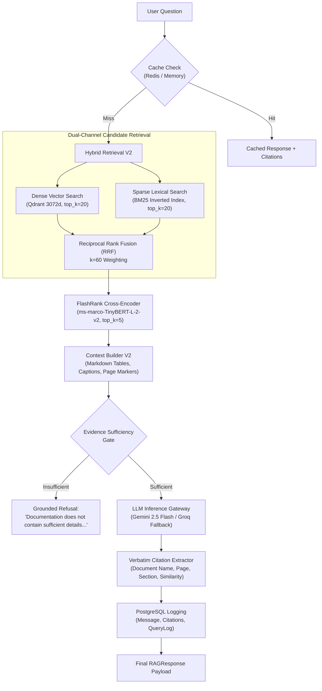

# 02. MASS QA Production Baseline & Frozen RAG Pipeline

## 1. Purpose & Scope

This document details the **MASS QA Multimodal RAG (Retrieval-Augmented Generation)** subsystem. It defines the document ingestion pipeline, hybrid retrieval strategy, FlashRank reranking engine, evidence sufficiency validation, LLM generation gateway, and verbatim citation architecture.

> **CRITICAL INVARIANT**: The Qdrant vector collection `mass_qa_multimodal` is **PERMANENTLY FROZEN**. No insertion, deletion, re-indexing, schema migration, or dimension alteration is permitted.

---

## 2. Frozen Baseline Specifications

```
================================================================================
QDRANT VECTOR DATABASE BASELINE — FROZEN ARTIFACT
================================================================================
Collection Name:       mass_qa_multimodal
Total Indexed Points:  2,079 points
Vector Dimension:      3072 dimensions
Distance Metric:       Cosine Similarity
Status:                PERMANENTLY FROZEN (Read-Only)
Embedding Model:       Google text-embedding-004 (or multimodal equivalent)
================================================================================
```

---

## 3. RAG Architecture & Pipeline Flow



---

## 4. Subsystem Components & Implementation

### 4.1 Hybrid Retrieval Engine
- **Location**: `app/services/retrieval/hybrid.py`
- **Dense Channel**: Queries Qdrant collection `mass_qa_multimodal` via cosine vector search, extracting dense scores.
- **Sparse Channel**: Tokenizes query and evaluates BM25 inverted index (`rank-bm25`) stored locally on disk for exact equipment tags (`PT-101`, `C-101`) and SOP identifiers.
- **Reciprocal Rank Fusion (RRF)**: Merges dense and sparse score lists using the standard formula:
  $$\text{RRF\_Score}(d) = \sum_{m \in \{\text{dense}, \text{sparse}\}} \frac{1}{60 + \text{Rank}_m(d)}$$

### 4.2 FlashRank CPU Cross-Encoder Reranking
- **Location**: `app/services/retrieval/reranker.py`
- **Model**: `ms-marco-TinyBERT-L-2-v2` (ultra-fast, CPU-optimized cross-encoder).
- **Function**: Takes top 20 candidates from RRF and scores individual `(query, document_chunk)` pairs to isolate the top 5 most contextually relevant passages.

### 4.3 Context Builder & Evidence Sufficiency Gate
- **Location**: `app/services/generation/context_builder.py`
- **Structure**: Assembles clean Markdown formatting with clear document provenance headers (`--- Document: [Name], Page: [P] ---`). Preserves markdown table syntax and visual bounding box captions.
- **Sufficiency Gate**: Checks relevance thresholds; if top score $< 0.35$ or no keywords match, avoids hallucinating by emitting a controlled out-of-domain response.

### 4.4 Grounded LLM Generation Gateway
- **Location**: `app/gateway/client.py`, `app/services/generation/generator.py`
- **Primary Model**: Google Gemini 2.5 Flash with temperature `0.1` for deterministic factual precision.
- **Resilient Fallback**: Automatic failover to Groq (`llama-3.3-70b-versatile`) on rate limit or API timeout.
- **Grounding Rule**: The system prompt strictly prohibits inferring unstated operational facts. Every technical claim must map to an retrieved context chunk.

---

## 5. Output Contracts & Citation Preservation

### 5.1 RAGResponse Contract
```python
class RAGResponse(BaseModel):
    answer: str
    citations: List[SourceCitation]
    confidence: str                 # "HIGH", "MEDIUM", "LOW"
    query_type: str                 # "TECHNICAL_QA", "SOP_LOOKUP", "GENERAL"
    grounded: bool                  # True if output verified against retrieved sources
    retrieval_count: int
    latency_breakdown: Dict[str, float]
    metadata: Dict[str, Any] = {}
```

### 5.2 SourceCitation Contract
```python
class SourceCitation(BaseModel):
    document_name: str              # e.g. "CDU_Startup_Procedure_SOP_04.pdf"
    page_number: Optional[int]      # e.g. 14
    section: Optional[str]          # e.g. "Section 4.2: Pump Priming"
    snippet: str                    # Verbatim excerpt from reference chunk
    score: float                    # Normalized similarity score (0.0 to 1.0)
    bounding_box: Optional[Dict[str, float]] = None
```

---

## 6. Caching Rules for QA Retrieval

- **Key Construction**: Hash of normalized lowercase query text + active filters (`md5(query.strip().lower())`).
- **TTL**: 3600 seconds (1 hour).
- **Storage**: Redis cache with fallback to in-memory dictionary.
- **Invalidation**: Invalidate cache on knowledge base document ingestion.

---

## 7. Operational Troubleshooting

| Symptom | Probable Cause | Diagnostic & Resolution |
| :--- | :--- | :--- |
| **Empty Citations in Answer** | Sufficiency gate triggered or score below threshold | Verify query phrasing against technical terms; inspect FlashRank scores in logs. |
| **Qdrant Connection Timeout** | Qdrant service offline or network partition | Check Qdrant container health (`GET http://localhost:6333/healthz`); verify vector count is 2,079. |
| **Gemini Quota Exceeded** | Upstream rate limit reached | Gateway automatically switches to Groq fallback; check `app/gateway/client.py` log events. |

---

## 8. Related Documentation

- [01_SYSTEM_ARCHITECTURE.md](file:///d:/Chatboat/DOCS/01_SYSTEM_ARCHITECTURE.md) — System-wide architecture and layer interaction.
- [05_QA_AGENT_ADAPTER.md](file:///d:/Chatboat/DOCS/05_QA_AGENT_ADAPTER.md) — Multi-agent wrapper around this frozen RAG pipeline.
- [12_SECURITY_OBSERVABILITY_CACHING.md](file:///d:/Chatboat/DOCS/12_SECURITY_OBSERVABILITY_CACHING.md) — Redis caching and Logfire observability details.
