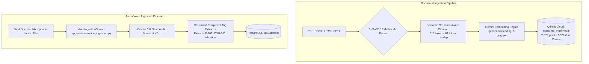

# 📥 Ingestion Engine: Data to Multimodal Knowledge Base

> **Document Version:** 2.0.0  
> **Status:** APPROVED & IMPLEMENTED  
> **Subsystem:** Ingestion & Vector Engine ([`app/services/vector_store.py`](file:///d:/Chatboat/app/services/vector_store.py), [`app/services/voice_ingestion.py`](file:///d:/Chatboat/app/services/voice_ingestion.py))

The Ingestion Engine is a high-performance pipeline designed to convert raw refinery technical data, SOPs, P&IDs, SOLs/IOWs, and voice notes into searchable vector and structured database formats.

---

## 🔄 The Pipeline Flow

---

## 🛠️ Technical Specifications

### 1. Document Parsing & Structure Preservation
- **PDFs & Manuals**: Processed locally using **PyMuPDF** (`fitz`) and `pdfplumber` to extract page numbers, markdown headers (`### Section`), and visual bounding boxes.
- **Tables & Matrices**: Preserves Markdown table syntax (`| Column | Value |`) without splitting rows across chunk boundaries.
- **Page Provenance**: Embedded directly into chunk payloads (`--- Document: SOP_P101.pdf, Page: 5 ---`).

### 2. Semantic Structure-Aware Chunking
- **Chunk Size**: `512` tokens (~380 words).
- **Overlap Window**: `64` tokens (~50 words) to prevent boundary context loss.
- **Header Prepending**: Automatically prepends parent section headers to every chunk.

### 3. Vectorization & Frozen Baseline Specifications
- **Embedding Model**: Google `gemini-embedding-2-preview` (3072 dimensions, L2 normalized).
- **Vector Database**: **Qdrant Cloud** hosting collection `mass_qa_multimodal`.
- **Frozen Collection Baseline**: 2,079 points, Cosine distance metric.

### 4. Audio Speech-to-Text Voice Ingestion
- **Engine**: Gemini 3.6 Flash Audio Transcriber (`VoiceIngestionService`).
- **Input Formats**: WAV, MP3, WebM, OGG, M4A audio streams recorded via the inline browser microphone.
- **Extraction**: Transcribes operator speech and extracts equipment tags (`CDU-101`, `P-101`), parameters, and unit status.
