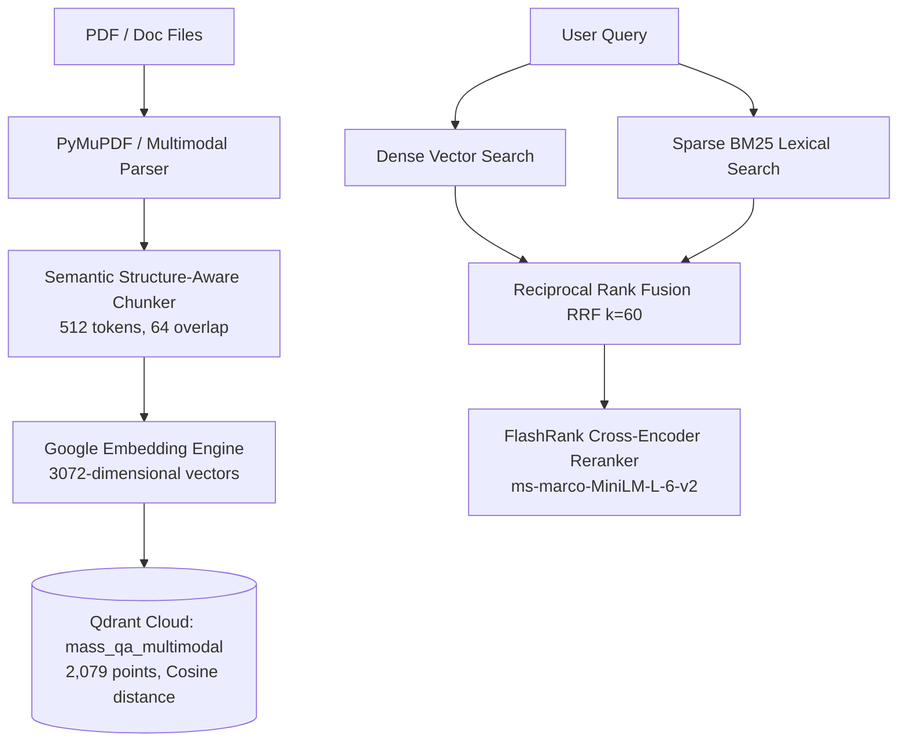

# MASS QA / Shift Handover Platform
# Document 21: Document Chunking, Embedding Pipeline & Vector Store Architecture

> **Document Version:** 1.0.0  
> **Status:** APPROVED & FROZEN BASELINE  
> **Subsystem:** Ingestion & Vector Engine ([`app/services/vector_store.py`](file:///d:/Chatboat/app/services/vector_store.py), [`app/services/retrieval/hybrid.py`](file:///d:/Chatboat/app/services/retrieval/hybrid.py))

---

## 1. Overview & Vector Invariants

The platform's technical QA engine relies on a **Frozen Multimodal Vector Knowledge Base** indexing petroleum refining SOPs, process units, P&IDs, SOLs/IOWs, and energy regulatory frameworks.



> [!IMPORTANT]
> **Frozen Baseline Invariant**: The Qdrant Cloud collection `mass_qa_multimodal` (2,079 points, 3072 dimensions, Cosine distance) is **permanently frozen**. No point deletion, collection recreation, schema modification, or vector dimension alteration is permitted.

---

## 2. Document Chunking Strategy

To preserve engineering context across technical manuals and tabular SOPs:

* **Chunk Window**: 512 tokens (~380 words).
* **Overlap Window**: 64 tokens (~50 words) to prevent boundary context loss.
* **Structure Preservation**:
  - Markdown section headers (`### Section 4.1: Pump Priming`) are prepended to every chunk.
  - Markdown table syntax (`| Column | Value |`) is preserved intact without row splitting.
  - Page provenance markers (`--- Document: SOP_P101.pdf, Page: 5 ---`) are embedded into chunk metadata.

---

## 3. Embedding Pipeline Specifications

* **Model**: Google `gemini-embedding-2-preview` (fallback `text-embedding-004`).
* **Vector Dimension**: **3072 dimensions**.
* **Normalization**: L2 normalized for Cosine distance evaluation.
* **Batch Size**: 32 chunks per batch embedding API call.

---

## 4. Qdrant Cloud Collection Architecture

```
================================================================================
QDRANT VECTOR COLLECTION SPECIFICATION
================================================================================
Collection Name:       mass_qa_multimodal
Point Count:           2,079 points
Vector Dimension:      3072 dimensions
Distance Metric:       Cosine Similarity
Payload Metadata:      {
                         "document_name": str,
                         "page_number": int,
                         "slide_number": int,
                         "content_type": "text" | "table" | "image_caption",
                         "text_content": str
                       }
================================================================================
```

---

## 5. Dual-Channel Hybrid Retrieval & Reranking

1. **Dense Channel**: Searches 3072-dim Qdrant vector space (top 20 candidates).
2. **Sparse Channel**: Evaluates BM25 inverted index (`rank-bm25`) for exact equipment tags (`P-101`, `CDU-101`) (top 20 candidates).
3. **Reciprocal Rank Fusion (RRF)**: Merges dense and sparse score lists using formula:
   $$\text{RRF\_Score}(d) = \sum_{m \in \{\text{dense}, \text{sparse}\}} \frac{1}{60 + \text{Rank}_m(d)}$$
4. **FlashRank CPU Cross-Encoder Reranking**: Evaluates top 20 candidates using `ms-marco-MiniLM-L-6-v2` cross-encoder to select the top 5 contextually relevant passages for LLM synthesis.
