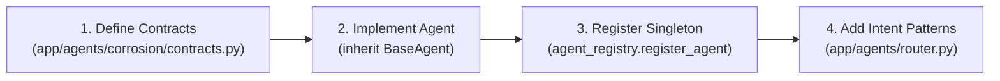

# 03. Multi-Agent Foundation & Contracts

## 1. Purpose & Scope

This document details the **Multi-Agent Foundation** established in Step 2 of the platform. It documents the abstract `BaseAgent` interface, strongly typed domain contracts (`AgentRequest`, `AgentContext`, `AgentResult`, `AgentResponse`), lifecycle states (`TaskStatus`), intent enumerations (`AgentIntent`), error classifications, and the centralized `AgentRegistry`.

---

## 2. Architectural Design Principles

1. **Strong Typing Over Dictionaries**: Every input, context, task, and result is modeled via Pydantic models. This eliminates runtime key errors and ensures strict contract enforcement across all agent boundaries.
2. **Encapsulation & Independence**: Agents do not directly call other agents' private methods; all inter-agent collaboration occurs through the `AgentOrchestrator` using standardized `AgentTask` and `AgentResult` schemas.
3. **Deterministic Error Handling**: Standardized `AgentErrorCode` enums and structured `error` objects replace raw Python exceptions, preventing sensitive stack traces from escaping to the UI.
4. **Extensibility**: Adding a new agent requires implementing only two standard abstract methods (`execute()` and `stream()`) and registering the singleton with `AgentRegistry`.

---

## 3. Core Class & Contract Definitions

### 3.1 BaseAgent (`app/agents/base.py`)
```python
class BaseAgent(ABC):
    """
    Abstract base class for all specialized domain agents.
    """
    def __init__(self, agent_id: str, name: str, capabilities: List[str], version: str = "1.0.0"):
        self.agent_id = agent_id
        self.name = name
        self.capabilities = capabilities
        self.version = version

    @abstractmethod
    def execute(self, request: AgentRequest, context: Optional[AgentContext] = None) -> AgentResult:
        """Synchronously execute agent logic."""
        pass

    @abstractmethod
    async def stream(self, request: AgentRequest, context: Optional[AgentContext] = None) -> AsyncGenerator[Dict[str, Any], None]:
        """Asynchronously stream token/event chunks."""
        pass
```

### 3.2 Domain Contracts (`app/agents/contracts.py`)

#### `AgentIntent` (Enum)
```python
class AgentIntent(str, Enum):
    QA = "QA"                                   # Technical RAG queries & SOP lookups
    SHIFT_HANDOVER = "SHIFT_HANDOVER"           # Operational shift management
    LOOP_ENGINEERING = "LOOP_ENGINEERING"       # ISA tag, wiring, and signal path checks
    MULTI_AGENT = "MULTI_AGENT"                 # Composite multi-domain workflows
    UNKNOWN = "UNKNOWN"                         # Unclassified fallback
```

#### `TaskStatus` (Enum)
```python
class TaskStatus(str, Enum):
    PENDING = "PENDING"
    RUNNING = "RUNNING"
    COMPLETED = "COMPLETED"
    FAILED = "FAILED"
    WAITING_APPROVAL = "WAITING_APPROVAL"
    CANCELLED = "CANCELLED"
```

#### `AgentRequest`
```python
class AgentRequest(BaseModel):
    request_id: str = Field(default_factory=lambda: str(uuid.uuid4()))
    user_id: Optional[str] = None
    conversation_id: Optional[str] = None
    session_id: str
    message: str
    intent: Optional[AgentIntent] = None
    parameters: Dict[str, Any] = Field(default_factory=dict)
    metadata: Dict[str, Any] = Field(default_factory=dict)
```

#### `AgentResult`
```python
class AgentResult(BaseModel):
    task_id: str
    agent_id: str
    success: bool
    response: str
    citations: List[Dict[str, Any]] = Field(default_factory=list)
    confidence: str = "HIGH"
    query_type: str = "GENERAL"
    grounded: bool = True
    retrieval_count: int = 0
    latency_breakdown: Dict[str, float] = Field(default_factory=dict)
    metadata: Dict[str, Any] = Field(default_factory=dict)
    error: Optional[Dict[str, Any]] = None
```

#### `AgentContext`
```python
class AgentContext(BaseModel):
    session_id: str
    user_id: Optional[str] = None
    user_role: Optional[str] = None
    conversation_history: List[Dict[str, str]] = Field(default_factory=list)
    active_handover_id: Optional[str] = None
    depth: int = 0
    a2a_trace: List[Dict[str, Any]] = Field(default_factory=list)
    metadata: Dict[str, Any] = Field(default_factory=dict)
```

---

## 4. Agent Registry (`app/agents/registry.py`)

The `AgentRegistry` is a thread-safe singleton managing the catalog of active agents.

```python
class AgentRegistry:
    def register_agent(self, agent: BaseAgent, priority: int = 100) -> None:
        """Register an agent with capability mapping."""
        
    def get_agent(self, agent_id: str) -> Optional[BaseAgent]:
        """Retrieve agent singleton by ID."""
        
    def get_agent_for_intent(self, intent: AgentIntent) -> Optional[BaseAgent]:
        """Lookup primary agent responsible for a given intent."""
        
    def list_agents(self) -> List[Dict[str, Any]]:
        """List registered agents and capabilities."""
```

### Active Registered Singletons:
1. `qa_technical_agent` (`QAAgentAdapter`): Handles `AgentIntent.QA`.
2. `shift_handover_agent` (`ShiftHandoverAgent`): Handles `AgentIntent.SHIFT_HANDOVER`.
3. `loop_engineering_agent` (`LoopEngineeringAgent`): Handles `AgentIntent.LOOP_ENGINEERING`.

---

## 5. Guide: How to Add a New Domain Agent

Follow this standard procedure to introduce a new agent (e.g. `CorrosionMonitoringAgent`):



### Step 1: Inherit from `BaseAgent`
```python
from app.agents.base import BaseAgent
from app.agents.contracts import AgentRequest, AgentResult, AgentContext

class CorrosionMonitoringAgent(BaseAgent):
    def __init__(self):
        super().__init__(
            agent_id="corrosion_monitoring_agent",
            name="Corrosion Monitoring Specialist",
            capabilities=["thickness_inspection", "corrosion_rate_calc"],
            version="1.0.0"
        )

    def execute(self, request: AgentRequest, context: Optional[AgentContext] = None) -> AgentResult:
        # Implement domain logic
        return AgentResult(
            task_id=str(uuid.uuid4()),
            agent_id=self.agent_id,
            success=True,
            response="Corrosion rate within nominal limits."
        )

    async def stream(self, request: AgentRequest, context: Optional[AgentContext] = None):
        yield {"type": "token", "content": "Corrosion rate within nominal limits."}
```

### Step 2: Register in `app/agents/__init__.py`
```python
from app.agents.corrosion.agent import corrosion_agent
agent_registry.register_agent(corrosion_agent)
```

### Step 3: Add Regex Patterns to `app/agents/router.py`
```python
CORROSION_PATTERNS = [r"\bcorrosion\b", r"\bwall thickness\b", r"\bcoupons\b"]
```

---

## 6. Related Documentation

- [01_SYSTEM_ARCHITECTURE.md](file:///d:/Chatboat/DOCS/01_SYSTEM_ARCHITECTURE.md) — System layer architecture.
- [04_AGENT_ORCHESTRATOR_ROUTER.md](file:///d:/Chatboat/DOCS/04_AGENT_ORCHESTRATOR_ROUTER.md) — Intent router and execution dispatching.
- [05_QA_AGENT_ADAPTER.md](file:///d:/Chatboat/DOCS/05_QA_AGENT_ADAPTER.md) — QA Agent implementation details.
