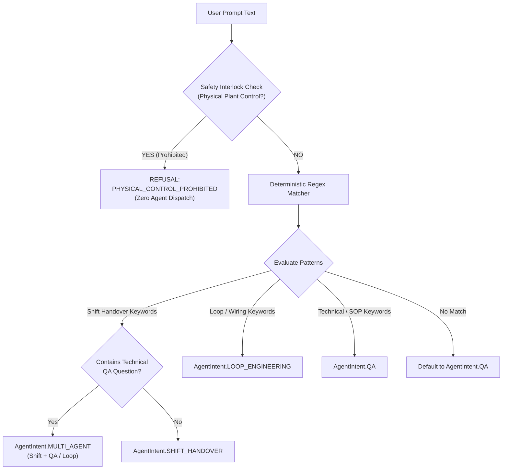
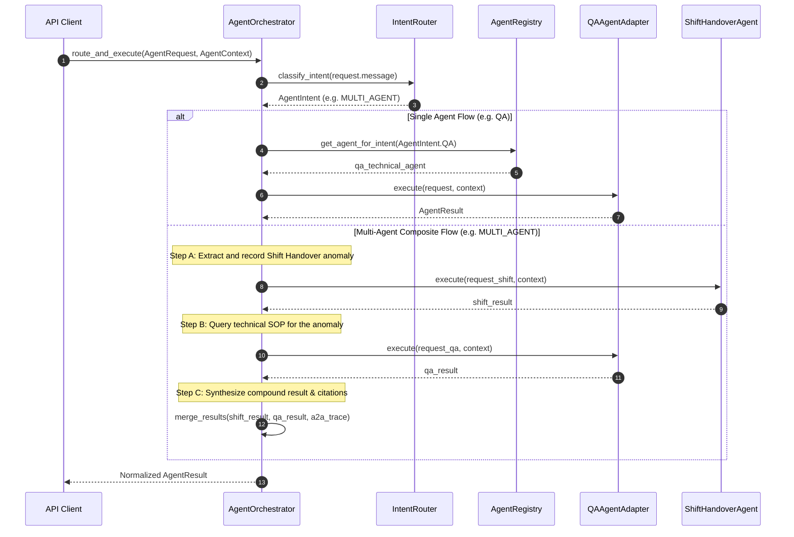

# 04. Agent Orchestrator, Intent Router & Safety Interlocks

## 1. Purpose & Scope

This document details the **Agent Orchestrator**, **Intent Router**, and **Safety Interlock** subsystems located in `app/agents/orchestrator.py` and `app/agents/router.py`. It explains the zero-token deterministic routing algorithm, multi-agent composite execution flow, conversational context propagation, and the non-negotiable physical equipment safety refusal mechanism.

---

## 2. Intent Routing Architecture (`app/agents/router.py`)

The `IntentRouter` provides **zero-token, ultra-fast (<1ms) deterministic intent classification** using compiled regular expressions and contextual scoring.



### 2.1 Routing Keyword & Regex Rules
1. **Safety Refusal Patterns**:
   - `\b(?:turn|switch|shut)\s*(?:off|down)\b`
   - `\b(?:open|close)\s+(?:the\s+)?(?:control\s+|isolation\s+)?valve\b`
   - `\btrip\b.*?\b(?:compressor|pump|turbine|unit|boiler|furnace|reactor|system|[A-Z]{1,3}-?\d{2,4})\b`
   - `\bbypass\b.*?\b(?:esd|sis|interlock|safety|alarm)\b`
   - `\bchange\s+setpoint\b`
2. **Shift Handover Patterns**:
   - `\b(?:shift\s+)?handover\b`, `\bcreate\s+handover\b`, `\bsubmit\s+handover\b`, `\bapprove\s+handover\b`, `\backnowledge\b`, `\bLOTO\b`, `\bpermit\b`
3. **Loop Engineering Patterns**:
   - `\bloop\s+(?:diagram|drawing|sheet)\b`, `\b(?:PT|TT|FT|LT|CV|FV|PV|LV)-\d{2,4}\b`, `\bsignal\s+path\b`, `\bjunction\s+box\b`, `\bmarshalling\b`, `\bI/O\s+card\b`
4. **Technical QA Patterns**:
   - `\bSOP\b`, `\bEOP\b`, `\bstartup\b`, `\bshutdown\b`, `\boperating\s+procedure\b`, `\bpressure\b`, `\btemperature\b`, `\bhow\s+to\b`

---

## 3. Physical Plant Control Safety Refusal

### The Non-Negotiable Safety Invariant:
> **The platform operates strictly as an intelligence, documentation, and handover advisory system. Under NO circumstances shall any prompt induce physical action on field equipment, valves, pumps, motors, or Emergency Shutdown (ESD) interlocks.**

### Example Execution:
- **User Prompt**: `"Shut down charge pump P-101 and open bypass valve BV-102"`
- **Router Classification**: `RiskLevel.CRITICAL` / `SafetyInterlockTriggered = True`
- **Immediate Response**:
  ```json
  {
    "success": false,
    "response": "SAFETY REFUSAL: Remote plant manipulation and equipment actuation commands are strictly prohibited. The system cannot execute physical control operations on plant equipment (P-101, BV-102). Please perform manual actuation following approved on-site operating procedures.",
    "error": {
      "code": "PHYSICAL_CONTROL_PROHIBITED",
      "message": "Physical equipment control operations are prohibited by safety policy."
    }
  }
  ```
- **Downstream Result**: Downstream agents, tools, and external services are **NOT** invoked.

---

## 4. Agent Orchestrator Execution Flow (`app/agents/orchestrator.py`)

The `AgentOrchestrator` coordinates the entire agent execution lifecycle:



---

## 5. Ambiguity Detection & Clarification

When a user query exhibits high ambiguity (e.g., `"Update it"` with no active handover ID, or `"What is the limit?"` with no instrument tag specified), the Orchestrator avoids guessing.

1. **State Inspection**: Checks `AgentContext.active_handover_id` and conversation history.
2. **Clarification Trigger**: If required entity IDs cannot be resolved, returns `requires_clarification = True`.
3. **Conversational Guidance**: Emits a targeted clarification prompt (e.g. *"Please specify the Unit ID or Handover ID you wish to update."*).

---

## 6. Testing & Verification

- **Test Suite**: [`tests/test_agent_orchestrator.py`](file:///d:/Chatboat/tests/test_agent_orchestrator.py)
- **Verified Baseline**: **64 / 64 unit and integration scenarios PASSED**.
- **Coverage**:
  - Intent classification accuracy (QA vs Shift vs Loop vs Multi-Agent vs Unknown).
  - Safety interlock interception on physical equipment manipulation keywords.
  - Multi-agent sequential execution and `a2a_trace` propagation.
  - Context depth limits and error shielding.

---

## 7. Related Documentation

- [01_SYSTEM_ARCHITECTURE.md](file:///d:/Chatboat/DOCS/01_SYSTEM_ARCHITECTURE.md) — System layer interactions.
- [03_MULTI_AGENT_FOUNDATION.md](file:///d:/Chatboat/DOCS/03_MULTI_AGENT_FOUNDATION.md) — Agent contracts and data structures.
- [08_SHIFT_HANDOVER_AGENT.md](file:///d:/Chatboat/DOCS/08_SHIFT_HANDOVER_AGENT.md) — Shift agent command processing.
- [10_HARNESS_ENGINEERING.md](file:///d:/Chatboat/DOCS/10_HARNESS_ENGINEERING.md) — Pre/post execution governance wrapping the Orchestrator.
