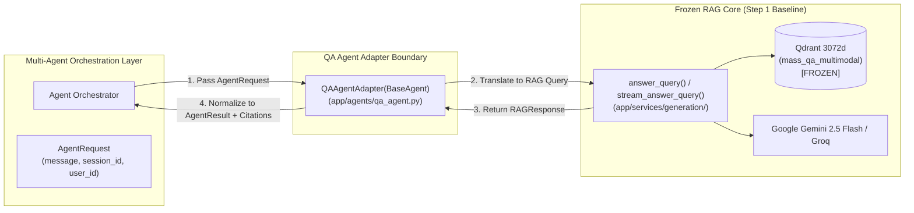

# 05. QA Agent Adapter Subsystem

## 1. Purpose & Scope

This document details the **QA Agent Adapter (`QAAgentAdapter`)** implemented in `app/agents/qa_agent.py`. The adapter serves as a clean bridge between the generic multi-agent contract system (`BaseAgent`, `AgentRequest`, `AgentResult`) and the **frozen, high-accuracy MASS QA / RAG pipeline** (`answer_query`, `stream_answer_query`).

---

## 2. Architectural Philosophy: The Adapter Pattern



### Why the Adapter Pattern was Chosen:
1. **Preservation of the Baseline**: The existing RAG pipeline had already passed exhaustive retrieval and factual accuracy evaluations. Wrapping it with an adapter avoids modifying any underlying retrieval logic, weights, or vector embeddings.
2. **Contract Normalization**: Converts multi-agent metadata and session parameters into the exact function signature expected by `answer_query()`, and maps the resulting `RAGResponse` into the standard `AgentResult` schema.
3. **Resilience & Timeout Shielding**: Catches low-level network timeouts, embedding errors, and rate limits, converting them into standardized `AgentErrorCode.RETRIEVAL_FAILED` or `AgentErrorCode.LLM_GENERATION_FAILED` objects.

---

## 3. Detailed Class Implementation (`app/agents/qa_agent.py`)

### 3.1 Class Definition & Initialization
```python
class QAAgentAdapter(BaseAgent):
    """
    Production adapter wrapping the frozen MASS QA RAG generation pipeline.
    """
    def __init__(
        self,
        agent_id: str = "qa_technical_agent",
        name: str = "MASS QA Technical Agent",
        query_fn: Callable = answer_query,
        stream_fn: Callable = stream_answer_query,
        version: str = "2.0.0"
    ):
        super().__init__(
            agent_id=agent_id,
            name=name,
            capabilities=[
                "answer_question",
                "search_knowledge_base",
                "return_citations",
                "technical_qa"
            ],
            version=version
        )
        self.query_fn = query_fn
        self.stream_fn = stream_fn
```

### 3.2 Synchronous Execution (`execute()`)
- Extracts `message`, `user_id`, and `session_id` from `AgentRequest`.
- Calls `self.query_fn(...)` with timeout protection.
- Maps `SourceCitation` models into serializable dictionaries (`document_name`, `page_number`, `section`, `snippet`, `score`, `bounding_box`).
- Populates `latency_breakdown` (`retrieval`, `reranking`, `llm_generation`).
- Emits structured `AgentResult`.

### 3.3 Asynchronous Streaming (`stream()`)
- Iterates over chunks yielded by `self.stream_fn(...)`.
- Yields SSE events formatted as:
  ```json
  {"type": "token", "content": "According to SOP-04, "}
  {"type": "token", "content": "the charge pump must be primed..."}
  {"type": "citations", "citations": [...]}
  {"type": "done", "status": "completed"}
  ```

---

## 4. Error Mapping & Defensive Handling

| Low-Level Exception | Mapped Agent Error Code | Client-Facing Safe Message |
| :--- | :--- | :--- |
| `QdrantTimeoutError` | `AgentErrorCode.RETRIEVAL_FAILED` | *"Knowledge base retrieval timed out. Please try again."* |
| `GeminiRateLimitError` | `AgentErrorCode.LLM_GENERATION_FAILED` | *"Upstream language model temporarily unavailable."* |
| `InsufficientEvidenceError` | `AgentErrorCode.GROUNDING_ERROR` | *"The requested procedure could not be verified in refinery documentation."* |

---

## 5. Verification & Testing

- **Test Suite**: [`tests/test_qa_agent.py`](file:///d:/Chatboat/tests/test_qa_agent.py)
- **Verified Baseline**: **10 / 10 tests PASSED**.
- **Coverage**:
  - Verification of synchronous `execute()` contract compliance.
  - Verification of asynchronous SSE `stream()` generator yield types.
  - Dependency injection of mock RAG generators for isolated testing.
  - Preservation of verbatim citation structures and score thresholds.

---

## 6. Related Documentation

- [02_BASELINE_RAG_QA.md](file:///d:/Chatboat/DOCS/02_BASELINE_RAG_QA.md) — Underpinning frozen RAG pipeline and Qdrant specs.
- [03_MULTI_AGENT_FOUNDATION.md](file:///d:/Chatboat/DOCS/03_MULTI_AGENT_FOUNDATION.md) — BaseAgent interface and AgentResult contract.
- [04_AGENT_ORCHESTRATOR_ROUTER.md](file:///d:/Chatboat/DOCS/04_AGENT_ORCHESTRATOR_ROUTER.md) — Routing requests to the QA Agent.
