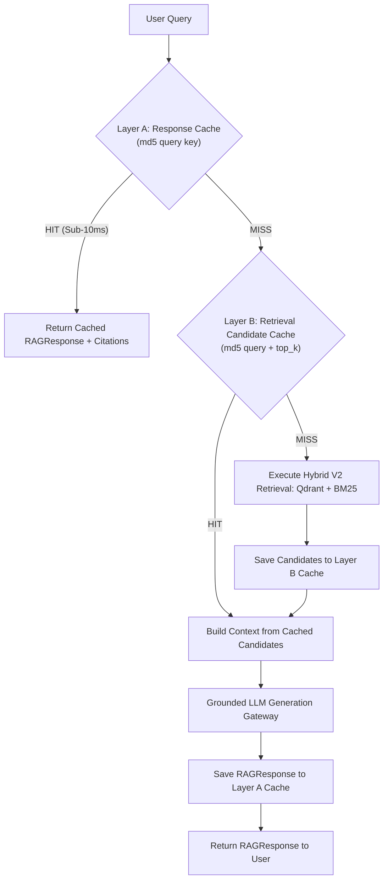

# MASS QA / Shift Handover Platform
# Document 20: Caching Architecture & Multi-Tier Optimization

> **Document Version:** 1.0.0  
> **Status:** APPROVED & IMPLEMENTED  
> **Subsystem:** Cache Engine ([`app/services/cache/cache_service.py`](file:///d:/Chatboat/app/services/cache/cache_service.py))

---

## 1. Overview & Architectural Philosophy

To achieve sub-100ms response times for technical QA queries while maintaining strict factual accuracy and zero stale operational data, the platform implements a **Multi-Tier Caching Architecture**.

---

## 2. Multi-Tier Cache Layers

### Layer A: Query Response Cache
- **Key Formula**: `resp:v2:<md5_hash_of_normalized_lowercased_question>`
- **TTL**: 3600 seconds (1 hour)
- **Data Cached**: Fully serialized `RAGResponse` model (including answer text, citations, confidence rating, query type, and thought process log).
- **Latency Impact**: Reduces query response latency from ~2.5s down to **< 10ms**.

### Layer B: Retrieval Candidate Cache
- **Key Formula**: `ret:<top_k>:v2:<md5_hash_of_normalized_lowercased_question>`
- **TTL**: 1800 seconds (30 minutes)
- **Data Cached**: Array of `RetrievalCandidate` objects returned by Reciprocal Rank Fusion (RRF) and FlashRank cross-encoder reranking.
- **Latency Impact**: Saves ~400ms of Qdrant vector database query and FlashRank CPU cross-encoder inference time.

### Layer C: Session & Dialogue History Cache
- **Key Formula**: `session:<session_id>`
- **TTL**: 86400 seconds (24 hours)
- **Data Cached**: `SessionState` containing the bounded $K = 4$ multi-turn conversation history.
- **Fallback**: Automatically falls back to PostgreSQL `messages` table if Redis is offline or session cache expires.

### Layer D: LLM Gateway & Prompt Caching
- **Implementation**: Integrates Portkey Gateway cache headers and Gemini system prompt caching flags (`[Cache: HIT ⚡]`).

---

## 3. Storage Drivers & Automatic Fallback

The caching service (`CacheService`) operates with dual storage drivers:

1. **Primary Driver (Redis)**: Connects to Redis instance on `localhost:6379`.
2. **Fallback Driver (In-Memory Thread-Safe Dict)**: If Redis is unavailable or times out, the cache engine automatically switches to an in-memory TTL dictionary without throwing exceptions or interrupting user chat operations.

---

## 4. Strict Caching Invariants

> [!CAUTION]
> **Shift Handover Operational Invariant**: Live shift handover state (`shift_handovers` table), FSM transitions, safety item acknowledgements, and supervisor approvals **MUST NEVER BE SERVED FROM A CACHE**. All shift handover reads and writes execute directly against PostgreSQL 18 with optimistic concurrency locking (`version` column).
