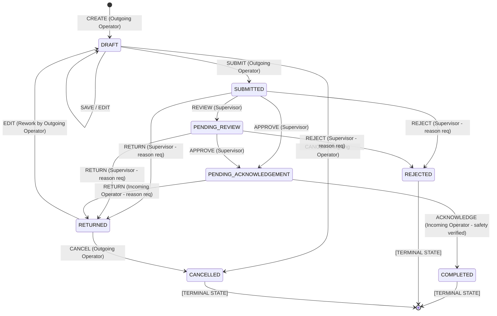

# 06. Shift Handover Business Workflow & Deterministic Engine

## 1. Purpose & Scope

This document details the **Shift Handover Business Workflow**, the finite state machine (FSM), operational roles, transition rules, and safety validation gates implemented in `app/agents/shift/contracts.py`, `app/agents/shift/transitions.py`, and `app/agents/shift/workflow.py`.

The workflow guarantees deterministic, safe, and audited custody transfers between operating crews across 12-hour refinery shift cycles.

---

## 2. Operational Roles (`ShiftHandoverRole`)

| Role Enum | Description & Authority | Allowed Core Workflow Actions |
| :--- | :--- | :--- |
| `CONSOLE_OPERATOR` | Board operator controlling DCS setpoints and unit parameters. Outgoing console operator initiates and prepares draft handovers. | `CREATE`, `SAVE`, `EDIT`, `SUBMIT`, `CANCEL` |
| `FIELD_OPERATOR` | Outside operator inspecting physical equipment, taking field readings, verifying LOTO isolations. | `EDIT` (Field Observations), `SAVE` |
| `OUTGOING_OPERATOR` | General operational alias representing outgoing shift custody. | `CREATE`, `SAVE`, `EDIT`, `SUBMIT`, `CANCEL` |
| `SHIFT_SUPERVISOR` | Shift management authority overseeing entire processing complex. Authoritative gatekeeper for handover review and approval. | `REVIEW`, `APPROVE`, `RETURN`, `REJECT`, `ESCALATE` |
| `INCOMING_OPERATOR` | Incoming shift operator assuming operational custody of the unit. Must acknowledge all active safety-critical items before accepting custody. | `REVIEW`, `ACKNOWLEDGE` |
| `OPERATIONS_ENGINEER` | Technical support reviewing unit mass balances and Sol/IOW limits. | `REVIEW` (Read-only / Comments) |
| `HSE_REPRESENTATIVE` | Safety representative auditing environmental permits and bypasses. | `REVIEW` (Safety audit) |
| `SYSTEM_ADMIN` | Platform administrator with maintenance and escalation overrides. | All actions (subject to audit logging) |

---

## 3. Workflow State Machine & Lifecycle



---

## 4. State-by-State Technical Specifications

### 4.1 `DRAFT`
- **Purpose**: Initial creation and iterative compilation of shift summary, equipment abnormalities, standing alarms, open permits, and LOTO logs.
- **Allowed Roles**: `CONSOLE_OPERATOR`, `OUTGOING_OPERATOR`, `FIELD_OPERATOR`.
- **Allowed Actions**: `CREATE`, `SAVE`, `EDIT`, `SUBMIT`, `CANCEL`.
- **Validations**: `unit_id`, `shift_type`, `outgoing_operator_id` must be present.
- **Next States**: `SUBMITTED`, `CANCELLED`.
- **Terminal**: No.

### 4.2 `SUBMITTED`
- **Purpose**: Handover has been finalized by outgoing operator and placed into supervisor review queue.
- **Allowed Roles**: `SHIFT_SUPERVISOR`, `SYSTEM_ADMIN`.
- **Allowed Actions**: `REVIEW`, `APPROVE`, `RETURN`, `REJECT`.
- **Validations**: Operational summary cannot be empty; all required fields must be non-null.
- **Next States**: `PENDING_REVIEW`, `PENDING_ACKNOWLEDGEMENT`, `RETURNED`, `REJECTED`.
- **Terminal**: No.

### 4.3 `PENDING_REVIEW`
- **Purpose**: Handover is actively under formal supervisory review.
- **Allowed Roles**: `SHIFT_SUPERVISOR`.
- **Allowed Actions**: `APPROVE`, `RETURN`, `REJECT`.
- **Next States**: `PENDING_ACKNOWLEDGEMENT`, `RETURNED`, `REJECTED`.
- **Terminal**: No.

### 4.4 `RETURNED`
- **Purpose**: Handover returned to outgoing operator for clarification or missing safety data (e.g. missing blind list).
- **Allowed Roles**: `OUTGOING_OPERATOR`, `CONSOLE_OPERATOR`.
- **Allowed Actions**: `EDIT`, `SAVE`, `SUBMIT`, `CANCEL`.
- **Requirement**: Must include supervisor's return reason in audit trail.
- **Next States**: `DRAFT`, `SUBMITTED`, `CANCELLED`.
- **Terminal**: No.

### 4.5 `PENDING_ACKNOWLEDGEMENT`
- **Purpose**: Supervisor has approved the handover. Awaiting incoming crew physical walkdown and safety checklist sign-off.
- **Allowed Roles**: `INCOMING_OPERATOR`, `INCOMING_SHIFT_OPERATOR`.
- **Allowed Actions**: `ACKNOWLEDGE`, `RETURN`.
- **Safety Precondition**: All active items in `safety_items` must have `acknowledged_by_incoming = True`.
- **Next States**: `COMPLETED`, `RETURNED`.
- **Terminal**: No.

### 4.6 `COMPLETED`
- **Purpose**: Unit operational custody is formally transferred to the incoming crew.
- **Allowed Roles**: None (read-only immutable archive).
- **Allowed Actions**: None.
- **Terminal**: **YES (Immutable)**.

### 4.7 `REJECTED` / `CANCELLED`
- **Purpose**: Handover permanently terminated or invalidated due to emergency abort or major administrative error.
- **Allowed Roles**: None (read-only archive).
- **Allowed Actions**: None.
- **Terminal**: **YES (Immutable)**.

---

## 5. Complete Transition Matrix Table

| Current State | Action | Role Permitted | Resulting State | Mandatory Preconditions |
| :--- | :--- | :--- | :--- | :--- |
| `None` | `CREATE` | `CONSOLE_OPERATOR`, `OUTGOING_OPERATOR` | `DRAFT` | Valid unit ID & date |
| `DRAFT` | `SAVE` / `EDIT`| `CONSOLE_OPERATOR`, `OUTGOING_OPERATOR` | `DRAFT` | Valid payload schema |
| `DRAFT` | `SUBMIT` | `CONSOLE_OPERATOR`, `OUTGOING_OPERATOR` | `SUBMITTED` | Non-empty summary |
| `DRAFT` | `CANCEL` | `CONSOLE_OPERATOR`, `OUTGOING_OPERATOR` | `CANCELLED` | Reason recorded |
| `SUBMITTED` | `REVIEW` | `SHIFT_SUPERVISOR` | `PENDING_REVIEW` | Active supervisor ID |
| `SUBMITTED` | `APPROVE` | `SHIFT_SUPERVISOR` | `PENDING_ACKNOWLEDGEMENT`| Active supervisor ID |
| `SUBMITTED` | `RETURN` | `SHIFT_SUPERVISOR` | `RETURNED` | Operational reason required |
| `SUBMITTED` | `REJECT` | `SHIFT_SUPERVISOR` | `REJECTED` | Operational reason required |
| `PENDING_REVIEW`| `APPROVE` | `SHIFT_SUPERVISOR` | `PENDING_ACKNOWLEDGEMENT`| Active supervisor ID |
| `PENDING_REVIEW`| `RETURN` | `SHIFT_SUPERVISOR` | `RETURNED` | Operational reason required |
| `PENDING_REVIEW`| `REJECT` | `SHIFT_SUPERVISOR` | `REJECTED` | Operational reason required |
| `RETURNED` | `EDIT` | `CONSOLE_OPERATOR`, `OUTGOING_OPERATOR` | `DRAFT` | Payload updates |
| `PENDING_ACK` | `ACKNOWLEDGE`| `INCOMING_OPERATOR` | `COMPLETED` | **All safety items signed off** |
| `PENDING_ACK` | `RETURN` | `INCOMING_OPERATOR` | `RETURNED` | Operational reason required |

---

## 6. Safety-Critical Checklist Enforcement

Before transitioning to `COMPLETED`, the workflow engine executes the `all_safety_items_acknowledged` validation:

```python
def validate_safety_acknowledgements(handover: ShiftHandover) -> bool:
    for item in handover.data.safety_items:
        if item.active and not item.acknowledged_by_incoming:
            return False
    return True
```

If any safety critical item (e.g., *Active LOTO on Feed Pump P-101B*) is unacknowledged, `execute_transition` raises `SafetyAcknowledgementMissingError`, blocking the transition.

---

## 7. Verification & Testing

- **Test Suite**: [`tests/test_shift_handover_workflow.py`](file:///d:/Chatboat/tests/test_shift_handover_workflow.py)
- **Verified Baseline**: **14 / 14 tests PASSED**.
- **Coverage**:
  - Full valid transition path (`DRAFT` $\to$ `SUBMITTED` $\to$ `PENDING_ACKNOWLEDGEMENT` $\to$ `COMPLETED`).
  - Strict role enforcement (operator cannot self-approve; field tech cannot submit).
  - Terminal state immutability (`COMPLETED` cannot be edited or submitted).
  - Safety-critical checklist sign-off enforcement.

---

## 8. Related Documentation

- [07_SHIFT_HANDOVER_DATABASE.md](file:///d:/Chatboat/DOCS/07_SHIFT_HANDOVER_DATABASE.md) — PostgreSQL persistence for shift handovers.
- [08_SHIFT_HANDOVER_AGENT.md](file:///d:/Chatboat/DOCS/08_SHIFT_HANDOVER_AGENT.md) — Natural language AI interface over this engine.
- [11_HITL_HUMAN_IN_THE_LOOP.md](file:///d:/Chatboat/DOCS/11_HITL_HUMAN_IN_THE_LOOP.md) — Human approval governance wrapping high-risk transitions.
