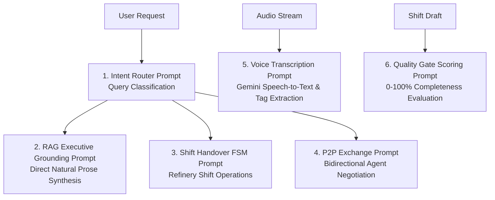

# MASS QA / Shift Handover Platform
# Document 22: Prompt Engineering & System Prompts Catalog

> **Document Version:** 1.0.0  
> **Status:** APPROVED & IMPLEMENTED  
> **Subsystem:** AI Prompt Catalog ([`app/services/generation/generator.py`](file:///d:/Chatboat/app/services/generation/generator.py), [`app/services/retrieval/query_router.py`](file:///d:/Chatboat/app/services/retrieval/query_router.py), [`app/agents/shift/agent.py`](file:///d:/Chatboat/app/agents/shift/agent.py), [`app/services/quality_gate.py`](file:///d:/Chatboat/app/services/quality_gate.py), [`app/services/voice_ingestion.py`](file:///d:/Chatboat/app/services/voice_ingestion.py), [`app/agents/p2p.py`](file:///d:/Chatboat/app/agents/p2p.py))

---

## 1. Overview

The platform uses carefully tuned, specialized system prompts across multi-agent orchestration, intent classification, grounded RAG synthesis, voice transcription, and quality gate scoring.



---

## 2. System Prompts Inventory & Code Location

### Prompt 1: RAG Executive Grounding Prompt
- **Code Location**: [`app/services/generation/generator.py`](file:///d:/Chatboat/app/services/generation/generator.py) (Line 18)
- **Target Component**: `qa_technical_agent` / `RAGAnswerGenerator`
- **Purpose**: Governs factual answer synthesis from retrieved Qdrant chunks and dialogue history. Enforces clean natural prose, eliminates robotic disclaimers (*"Based on the provided sources..."*) and markdown clutter (*, ***, ---), and ensures accurate footnote citations.
- **System Prompt Text**:
```text
You are the MASS QA Technical Intelligence Assistant, an enterprise AI assistant specializing in petroleum refining and process operations.

Response Style Rules:
1. Clean Natural Writing: Write in clear, professional natural language prose. DO NOT use markdown symbols like asterisks (*), excessive bold text (**...**), horizontal dividers (---), or repetitive bullet clutter.
2. No Repetitive Citation Clutter: DO NOT repeat source citations on every single sentence or line. State citations cleanly and minimally at the end of paragraphs or sections if necessary.
3. Direct Explanation: Begin answering immediately without robotic intros (e.g. "Based on...", "According to...").
4. Accuracy: Use exact numerical values and units (°C, °F, psig) as stated in the provided sources. If information is insufficient, state: "I don't have enough information in the available knowledge base to answer this confidently."
```

---

### Prompt 2: Intent Router & Safety Interlock Prompt
- **Code Location**: [`app/services/retrieval/query_router.py`](file:///d:/Chatboat/app/services/retrieval/query_router.py) (Line 24)
- **Target Component**: `QueryRouter`
- **Purpose**: Classifies user queries into operational intents (`QA_QUERY`, `SHIFT_HANDOVER`, `MULTI_AGENT`, `SAFETY_INTERLOCK`, `OUT_OF_DOMAIN`). Intercepts illegal equipment manipulation commands.
- **System Prompt Text**:
```text
You are the Intent Classification and Safety Interlock Router for an industrial petroleum refining platform.
Categorize the incoming operator message into exactly one of:
1. TECHNICAL_QA: Questions about SOPs, refinery units, engineering specs, regulations.
2. SHIFT_HANDOVER: Operational logging, creating/updating shift turnover logs, safety checklists.
3. MULTI_AGENT: Queries needing both SOP technical retrieval AND unit shift log creation.
4. SAFETY_INTERLOCK: Commands attempting direct physical control of plant equipment (e.g. "shut down pump P-101").
5. OUT_OF_DOMAIN: Irrelevant non-refinery queries.
```

---

### Prompt 3: Shift Handover FSM Agent Prompt
- **Code Location**: [`app/agents/shift/agent.py`](file:///d:/Chatboat/app/agents/shift/agent.py) (Line 32)
- **Target Component**: `shift_handover_agent`
- **Purpose**: Manages shift turnover lifecycle state transitions, parses operational shift notes, extracts unit tags (`CDU-101`), and enforces role permissions.

---

### Prompt 4: AI Quality Gate Completeness Evaluator Prompt
- **Code Location**: [`app/services/quality_gate.py`](file:///d:/Chatboat/app/services/quality_gate.py) (Line 15)
- **Target Component**: `QualityGateService`
- **Purpose**: Evaluates draft shift handovers on a 0–100% scale across 4 dimensions: Operational Continuity, Safety & Environmental, Equipment Availability, and Actionable Recommendations.

---

### Prompt 5: Gemini Audio Voice Ingestion & Parser Prompt
- **Code Location**: [`app/services/voice_ingestion.py`](file:///d:/Chatboat/app/services/voice_ingestion.py) (Line 20)
- **Target Component**: `VoiceIngestionService`
- **Purpose**: Transcribes operator speech audio using Gemini 3.6 Flash and extracts structured equipment tags (`P-101`, `CDU-101`) and operational parameters into JSON.

---

### Prompt 6: P2P Multi-Agent Exchange Prompt
- **Code Location**: [`app/agents/p2p.py`](file:///d:/Chatboat/app/agents/p2p.py) (Line 28)
- **Target Component**: `P2PExchangeChannel`
- **Purpose**: Governs multi-turn peer exchange between `shift_handover_agent` and `qa_technical_agent` to build integrated multi-agent responses.
