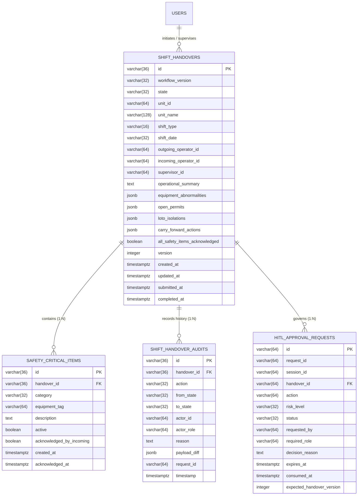
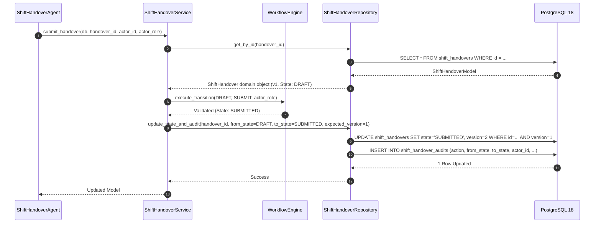

# 07. PostgreSQL Persistence Layer & Shift Database Design

## 1. Purpose & Scope

This document details the **PostgreSQL 18 relational persistence layer** implemented in Step 6. It documents the entity relationship schema, SQLAlchemy 2.0 ORM models, Alembic migrations, optimistic concurrency control (`version` locking), JSONB operational structures, and immutable audit logging.

---

## 2. Relational Schema & Entity Relationships



---

## 3. Database Models & Schema Definitions

### 3.1 `shift_handovers` Table (`app/db/models/shift_handover.py`)
- **Aggregate Root**: Encapsulates the complete shift turnover record.
- **Optimistic Concurrency**: Uses an integer column `version` incremented on each mutation.
- **Indexes**:
  - `ix_shift_handovers_unit_date`: Compound index on `(unit_id, shift_date)`.
  - `ix_shift_handovers_state`: Index on `state` for supervisor review queues.
  - `ix_shift_handovers_outgoing`: Index on `outgoing_operator_id`.

### 3.2 `shift_safety_critical_items` Table
- **Purpose**: Discrete, relational tracking of active Lockout/Tagout (LOTO) isolations, Emergency Shutdown (ESD) overrides, and Standing Alarms.
- **Foreign Key**: `handover_id` $\to$ `shift_handovers.id` with `ON DELETE CASCADE`.

### 3.3 `shift_handover_audits` Table
- **Purpose**: Append-only, immutable historical ledger recording every state change, actor ID, operational role, request correlation ID, and state transition payload.
- **Security**: Updates and deletes are prohibited at the application layer.

### 3.4 `hitl_approval_requests` Table (`app/db/models/hitl_approval.py`)
- **Purpose**: Persists pending and decided Human-In-The-Loop approval gates, expiration windows, decider signatures, and concurrency versions.

---

## 4. Optimistic Concurrency Control (`version` column)

To prevent the "lost update" problem when multiple operators or engineers view and edit a draft simultaneously, the repository enforces optimistic locking:

```python
# In ShiftHandoverRepository.update_handover():
current_version = handover.version
stmt = (
    update(ShiftHandoverModel)
    .where(ShiftHandoverModel.id == handover_id)
    .where(ShiftHandoverModel.version == current_version)
    .values(**updated_fields, version=current_version + 1)
)
result = session.execute(stmt)
if result.rowcount == 0:
    session.rollback()
    raise ConcurrencyConflictError(
        f"Handover {handover_id} was modified by another user. Version mismatch (expected v{current_version})."
    )
```

If a concurrent update occurred, `ConcurrencyConflictError` is raised, mapped by FastAPI to `HTTP 409 CONFLICT` with client message *"Another user modified this handover. Please refresh and try again."*

---

## 5. Persistence Service & Repository Flow



---

## 6. Verification & Testing

- **Test Suite**: [`tests/test_shift_handover_persistence.py`](file:///d:/Chatboat/tests/test_shift_handover_persistence.py)
- **Verified Baseline**: **20 / 20 tests PASSED**.
- **Coverage**:
  - Full CRUD operations and relational mapping.
  - Optimistic concurrency conflict rejection (concurrent write simulation).
  - Transaction rollback on mid-operation validation failure.
  - Immutable audit trail recording and historical diff queries.

---

## 7. Related Documentation

- [06_SHIFT_HANDOVER_WORKFLOW.md](file:///d:/Chatboat/DOCS/06_SHIFT_HANDOVER_WORKFLOW.md) — Workflow state machine rules.
- [08_SHIFT_HANDOVER_AGENT.md](file:///d:/Chatboat/DOCS/08_SHIFT_HANDOVER_AGENT.md) — Shift Handover agent calling this persistence layer.
- [11_HITL_HUMAN_IN_THE_LOOP.md](file:///d:/Chatboat/DOCS/11_HITL_HUMAN_IN_THE_LOOP.md) — HITL approval table and staleness checks.
