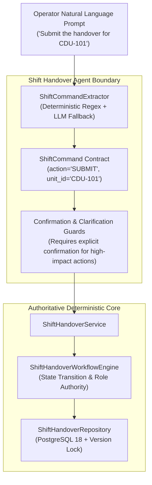

# 08. Shift Handover Agent & Natural Language Command Interface

## 1. Purpose & Scope

This document details the **Shift Handover Agent (`ShiftHandoverAgent`)** and its **Natural Language Command Extractor (`ShiftCommandExtractor`)** implemented in `app/agents/shift/agent.py`, `app/agents/shift/extractor.py`, and `app/agents/shift/command.py`.

The Shift Agent serves as a conversational, natural-language interface over the deterministic `ShiftHandoverWorkflowEngine` and PostgreSQL persistence layer, translating operator intent into validated workflow commands.

---

## 2. Core Architectural Separation



### Critical Non-Negotiable Invariants:
1. **The Agent is NOT the Workflow Engine**: The LLM never decides if a transition is valid. It merely extracts parameters and calls `ShiftHandoverService`.
2. **The Agent Never Directly Manipulates PostgreSQL**: All database writes pass through `ShiftHandoverRepository` with transaction control and optimistic locking.
3. **The Agent Never Bypasses Role Authority**: The actor's authenticated role from the JWT token is passed directly to the engine for deterministic authorization.

---

## 3. Command Extraction (`ShiftCommandExtractor`)

The `ShiftCommandExtractor` uses dual-phase extraction:
- **Phase 1 (Deterministic Regex)**: Zero-token regex extractors match common operational keywords (`create handover`, `submit`, `approve`, `return`, `acknowledge`, `unit CDU-101`, `SHO-101`).
- **Phase 2 (Structured LLM Parsing)**: If regex confidence is low or complex operational notes are supplied (e.g., extracting multiple compressor vibration readings and LOTO isolations), dispatches to structured LLM extraction.

### Extracted Contract (`ShiftCommand`):
```python
class ShiftCommand(BaseModel):
    action: ShiftHandoverAction     # CREATE, SAVE, EDIT, SUBMIT, APPROVE, RETURN, REJECT, ACKNOWLEDGE, CANCEL
    handover_id: Optional[str] = None
    unit_id: Optional[str] = None
    shift_type: Optional[ShiftType] = None
    summary: Optional[str] = None
    abnormalities: List[str] = Field(default_factory=list)
    safety_items: List[Dict[str, Any]] = Field(default_factory=list)
    reason: Optional[str] = None
    confidence: float = 1.0
```

---

## 4. End-to-End User Interaction Examples

### 4.1 "Create a handover for CDU-101"
1. **Extraction**: `action = CREATE`, `unit_id = "CDU-101"`, `shift_type = DAY`.
2. **Execution**: Calls `ShiftHandoverService.create_handover(...)`.
3. **Database**: Inserts row into `shift_handovers` with `state = DRAFT`, `version = 1`.
4. **Agent Response**:
   > *"Draft shift handover created successfully for **CDU-101** (ID: `SHO-2026-CDU101-01`). You can now add equipment abnormalities, open permits, and operational notes."*

### 4.2 "Add compressor C-101 high vibration to draft"
1. **Extraction**: `action = EDIT`, `abnormalities = ["Compressor C-101 high vibration (4.5 mm/s)"]`.
2. **Execution**: Calls `ShiftHandoverService.update_handover(...)`.
3. **Database**: Appends observation to `equipment_abnormalities` JSONB column, increments `version = 2`.
4. **Agent Response**:
   > *"Updated draft `SHO-2026-CDU101-01`. Added equipment abnormality for **Compressor C-101**."*

### 4.3 "Submit the handover"
1. **Extraction**: `action = SUBMIT`.
2. **Policy Check**: High-risk action requires human confirmation/authorization.
3. **Execution**: `ShiftHandoverService.submit_handover(...)` transitions state from `DRAFT` to `SUBMITTED`.
4. **Audit**: Inserts audit log with actor ID and timestamp.
5. **Agent Response**:
   > *"Handover `SHO-2026-CDU101-01` has been **SUBMITTED** for Supervisor review."*

### 4.4 "Approve handover SHO-2026-CDU101-01"
1. **Role Check**: Verifies actor role is `SHIFT_SUPERVISOR`.
2. **Execution**: Transitions state to `PENDING_ACKNOWLEDGEMENT`.
3. **Agent Response**:
   > *"Handover `SHO-2026-CDU101-01` **APPROVED** by Supervisor. Status is now **PENDING ACKNOWLEDGEMENT** by incoming crew."*

### 4.5 "Return handover because LOTO list is incomplete"
1. **Extraction**: `action = RETURN`, `reason = "LOTO list is incomplete"`.
2. **Validation**: Checks that mandatory `reason` is present.
3. **Execution**: Transitions state to `RETURNED`, saving reason in audit trail.
4. **Agent Response**:
   > *"Handover `SHO-2026-CDU101-01` **RETURNED** to outgoing operator. Reason: 'LOTO list is incomplete'."*

---

## 5. Verification & Testing

- **Test Suite**: [`tests/test_shift_agent.py`](file:///d:/Chatboat/tests/test_shift_agent.py)
- **Verified Baseline**: **25 / 25 tests PASSED**.
- **Coverage**:
  - Natural language command extraction across all 8 actions.
  - Role enforcement (operator rejected on approve command).
  - Terminal state protection (cannot edit completed handover).
  - Optimistic locking conflict translation into user-friendly error messages.

---

## 6. Related Documentation

- [06_SHIFT_HANDOVER_WORKFLOW.md](file:///d:/Chatboat/DOCS/06_SHIFT_HANDOVER_WORKFLOW.md) — Workflow state machine.
- [07_SHIFT_HANDOVER_DATABASE.md](file:///d:/Chatboat/DOCS/07_SHIFT_HANDOVER_DATABASE.md) — PostgreSQL persistence models.
- [09_API_CHATBOT_INTEGRATION.md](file:///d:/Chatboat/DOCS/09_API_CHATBOT_INTEGRATION.md) — Exposing the Shift Agent via FastAPI.
