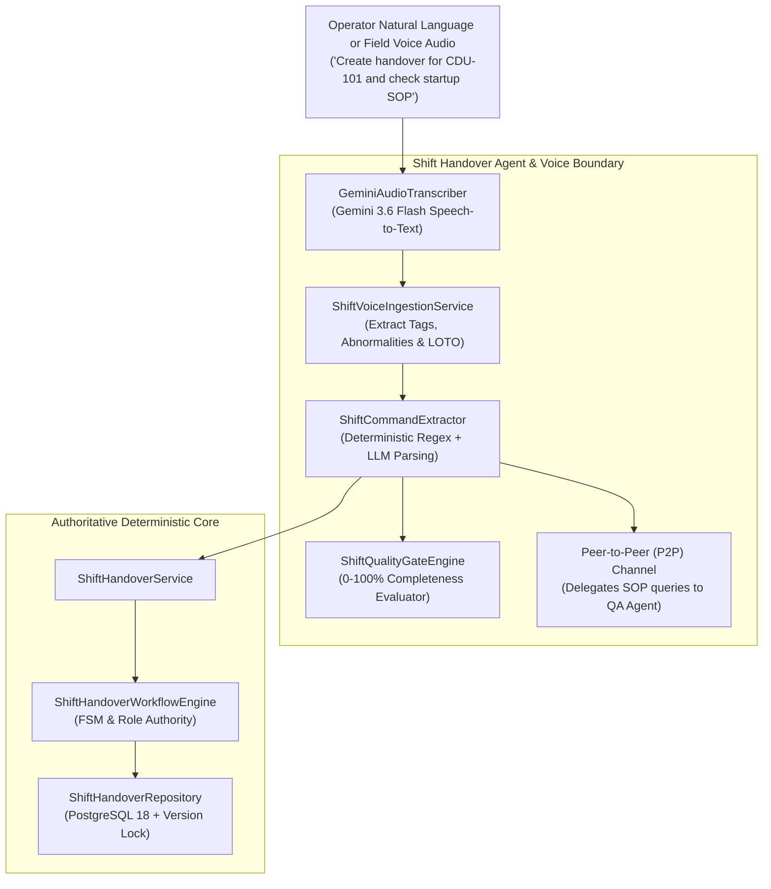

# 08. Shift Handover Agent, Voice Ingestion & Quality Gate

## 1. Purpose & Scope

This document details the **Shift Handover Agent (`ShiftHandoverAgent`)**, its **Natural Language Command Extractor (`ShiftCommandExtractor`)**, the **Gemini Audio Voice Ingestion Subsystem**, and the **AI Quality Gate Engine** implemented in:
- `app/agents/shift/agent.py`
- `app/agents/shift/extractor.py`
- `app/agents/shift/quality_gate.py`
- `app/services/voice/transcribe.py`
- `app/services/shift_voice_service.py`

The Shift Agent serves as a conversational natural-language and voice interface over the deterministic `ShiftHandoverWorkflowEngine` and PostgreSQL persistence layer.

---

## 2. Core Subsystem Architecture

---

## 3. Gemini Audio Voice Ingestion

The **Field Voice Ingestion Subsystem** allows field operators to speak updates directly into their device microphone:
1. **Audio Speech-to-Text (`GeminiAudioTranscriber`)**: Uses `gemini-3.6-flash` to transcribe audio files (`.wav`, `.mp3`, `.m4a`).
2. **Structured Attribute Extraction (`ShiftVoiceIngestionService`)**:
   - **Equipment Tags**: Regex matching ISA-5.1 tags (`P-101A`, `CDU-101`, `C-101`).
   - **Abnormalities**: Extracts operational anomalies (`pump cavitation`, `seal weeping`).
   - **LOTO / Work Permits**: Extracts isolation tags (`LOTO-101`, `PTW-402`).

---

## 4. AI Quality Gate Engine (`ShiftQualityGateEngine`)

Before a shift handover can be submitted or approved, the **Quality Gate Engine** ([`app/agents/shift/quality_gate.py`](file:///d:/Chatboat/app/agents/shift/quality_gate.py)) evaluates its completeness on a **0-100% scale** across 4 dimensions:

| Dimension | Weight | Target Content |
| :--- | :---: | :--- |
| **Operational Summary** | 25.0 pts | Narrative of shift operations and unit targets |
| **Safety Critical Items** | 25.0 pts | Documented LOTO isolations, ESD bypasses, and PTW permits |
| **Equipment Status** | 25.0 pts | Equipment trips, maintenance notes, and abnormalities |
| **Work Permits & Actions**| 25.0 pts | Open work permits and mandatory carry-forward actions |

- **Passing Threshold**: `70.0%`
- **Output**: Generates `overall_score`, `is_passing`, list of `missing_items`, and `recommendations`.

---

## 5. Peer-to-Peer (P2P) A2A Delegation

If a shift handover request or voice note asks for engineering documentation or SOP procedures (e.g. *"Log issue on P-101A and fetch its startup SOP"*), the `ShiftHandoverAgent` uses `self.delegate()` to initiate a **Bidirectional P2P Peer Exchange** with `qa_technical_agent` ([`app/agents/p2p.py`](file:///d:/Chatboat/app/agents/p2p.py)), embedding the retrieved SOP citations directly into the shift log.
