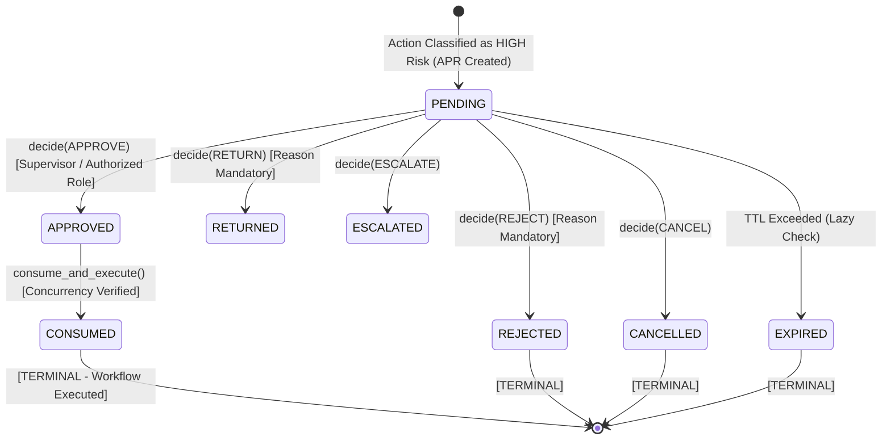

# 11. Human-In-The-Loop (HITL) & Risk-Based Approval Governance

## 1. Purpose & Scope

This document details the **Human-In-The-Loop (HITL)** and **Risk-Based Approval Governance** architecture implemented in Step 10 under `app/governance/`.

The system enforces a strict operational principle:

$$\text{AI Proposes} \implies \text{System Assesses Risk} \implies \text{Human Approves} \implies \text{Deterministic Engine Executes} \implies \text{PostgreSQL Audit}$$

---

## 2. 4-Tier Risk Classification Matrix (`app/governance/risk.py`)

| Tier | Operations Covered | Autonomy & Governance Action |
| :--- | :--- | :--- |
| **`LOW`** | SOP lookup, document QA, read-only handover viewing, general technical summaries. | **Fully Autonomous**: Executed directly without blocking. |
| **`MEDIUM`** | Creating draft handovers, editing draft fields, recording non-critical observations. | **Automated Validation**: Executed directly with schema validation. |
| **`HIGH`** | Submitting handovers, supervisor approval, rejection, returning handovers, acknowledging safety items. | **HITL Required**: System generates an approval request (`APR-...`) in `PENDING` state and halts execution until authorized human decision. |
| **`CRITICAL`**| Physical equipment actuation, valve opening/closing, pump tripping, ESD bypass, alarm override. | **PERMANENTLY PROHIBITED**: Hard refusal by Safety Interlock. |

---

## 3. HITL Approval Request Lifecycle (`app/governance/hitl.py`)

---

## 4. Governance & Safety Guarantees

### 4.1 Separation of Duties
A user who creates or submits a high-risk handover cannot approve their own request. If `decider_id == approval.requested_by`, `decide_approval()` raises `SeparationOfDutiesViolationError` (`HTTP 403 FORBIDDEN`).

### 4.2 Strict Role Authorization
Approval decisions require an authorized operational role (`SHIFT_SUPERVISOR` for approvals, `INCOMING_OPERATOR` for custody acknowledgement). Submissions by unauthorized roles raise `UnauthorizedApproverError` (`HTTP 403 FORBIDDEN`).

### 4.3 Replay & Double-Execution Protection
Once an approval is consumed and executed, its status transitions to `CONSUMED` and `consumed_at` is timestamped. Any subsequent execution attempt immediately raises `ApprovalAlreadyConsumedError` (`HTTP 409 CONFLICT`), preventing duplicate workflow state transitions.

### 4.4 Optimistic Concurrency Staleness Check
When `consume_and_execute()` is invoked, it verifies that the live handover version matches the `expected_handover_version` recorded when the approval was created. If another user edited the handover while approval was pending, execution is safely rejected with `ApprovalStaleError` (`HTTP 409 CONFLICT`).

### 4.5 Expiration Windows (TTL)
Approval requests carry an expiration timestamp (default TTL: 3600 seconds). If a decision is attempted after expiration, the request is marked `EXPIRED` and raises `ApprovalExpiredError` (`HTTP 400 BAD REQUEST`).

---

## 5. Chatbot Transparency & Truthfulness Invariant

The chatbot interface is strictly prohibited from claiming a state change has succeeded before deterministic execution occurs.

- **Incorrect / Prohibited Behavior**:
  - *User*: *"Submit this handover."*
  - *Bot (Fake)*: *"Handover submitted successfully."* (When it is actually awaiting supervisor approval).
- **Correct / Implemented Behavior**:
  - *User*: *"Submit this handover."*
  - *Bot (Authoritative)*: *"This action requires authorized human approval. I have created approval request `APR-89A12DF`. Status is currently **PENDING** supervisor review."*

---

## 6. Verification & Testing

- **Test Suite**: [`tests/test_hitl_governance.py`](file:///d:/Chatboat/tests/test_hitl_governance.py)
- **Verified Baseline**: **20 / 20 tests PASSED**.
- **Coverage**:
  - Risk classification across LOW, MEDIUM, HIGH, CRITICAL tiers.
  - Separation of duties violation enforcement.
  - Replay and double-execution protection.
  - Stale approval rejection on optimistic locking version mismatch.
  - Expiration enforcement on past-due approval tokens.
  - Mandatory reason validation on rejection and return.

---

## 7. Related Documentation

- [06_SHIFT_HANDOVER_WORKFLOW.md](file:///d:/Chatboat/DOCS/06_SHIFT_HANDOVER_WORKFLOW.md) — Workflow state machine.
- [09_API_CHATBOT_INTEGRATION.md](file:///d:/Chatboat/DOCS/09_API_CHATBOT_INTEGRATION.md) — `/approvals` REST API routes.
- [10_HARNESS_ENGINEERING.md](file:///d:/Chatboat/DOCS/10_HARNESS_ENGINEERING.md) — AI Harness governance boundary.
