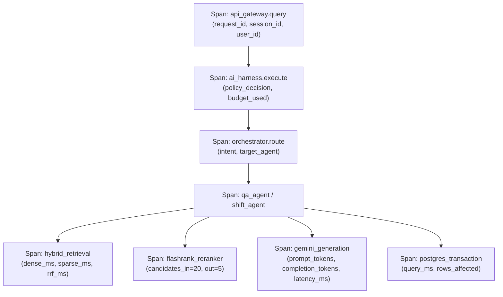

# 12. Security, Observability & Caching Infrastructure

## 1. Purpose & Scope

This document details the production engineering infrastructure supporting the platform across three core pillars: **Security & Access Control (RBAC)**, **Distributed Observability & Telemetry**, and **Deterministic Multi-Level Caching**.

---

## 2. Security & Access Control (RBAC)


### 2.1 Cryptographic Authentication & JWT Mechanics
- **Token Generation**: `/api/v1/auth/token` issues JWTs signed with `JWT_SECRET_KEY` using HMAC-SHA256 (or RSA).
- **Token Expiry**: Default 8 hours (`ACCESS_TOKEN_EXPIRE_MINUTES = 480`).
- **Claims Schema**:
  ```json
  {
    "sub": "salem_operator",
    "user_id": "op_salem_01",
    "role": "CONSOLE_OPERATOR",
    "scopes": ["qa:read", "shift:write"],
    "exp": 1756000000
  }
  ```

### 2.2 Security Middleware & Headers
- **`SecurityHeadersMiddleware`**: Injects `Content-Security-Policy`, `X-Frame-Options: DENY`, `X-Content-Type-Options: nosniff`, and `Strict-Transport-Security`.
- **CORS Configuration**: Restricts access strictly to configured origins in `settings.CORS_ALLOWED_ORIGINS`.
- **SQL Injection Prevention**: 100% of relational queries utilize SQLAlchemy 2.0 parameterized queries and ORM object binding.

---

## 3. Observability & Distributed Tracing

The platform integrates **Logfire** and **OpenTelemetry** for structured, distributed tracing across every layer.



### 3.1 Trace Context Propagation
Every downstream database log (`shift_handover_audits`, `query_logs`), vector query, and LLM call carries:
- `request_id`: UUID tracing the single HTTP transaction.
- `session_id`: Persistent conversation thread identifier.
- `user_id`: Authenticated operator identity.
- `agent_id`: Designated executing agent.

### 3.2 Latency Breakdown Reporting
The API response returns fine-grained latency profiling:
```json
"latency_breakdown": {
  "retrieval": 0.124,
  "reranking": 0.045,
  "llm_generation": 0.235,
  "database": 0.008
}
```

---

## 4. Multi-Level Caching Policy

```
================================================================================
CRITICAL CACHING INVARIANTS
================================================================================
1. TECHNICAL QA & SOP QUERIES:      CACHEABLE (TTL = 3600 seconds)
2. SHIFT HANDOVER OPERATIONAL STATE: NEVER CACHED (STRICT DATABASE PASSTHROUGH)
================================================================================
```

### 4.1 What CAN Be Cached:
- Static SOP lookups, technical procedural queries, and general knowledge base answers.
- Key format: `md5("qa:" + normalized_query_text)`.
- Cache storage: Redis instance with fallback to in-memory TTL dictionary.

### 4.2 What MUST NEVER Be Cached:
- **Shift handover state, active LOTO isolations, standing alarms, open permits, and approval statuses MUST NEVER be cached.**
- Serving cached shift handover data could present stale safety isolations to an incoming operator during physical relief, creating catastrophic plant risk.
- All shift handover operations explicitly bypass `CacheService` and execute against PostgreSQL with read-committed or repeatable-read isolation.

---

## 5. Related Documentation

- [01_SYSTEM_ARCHITECTURE.md](file:///d:/Chatboat/DOCS/01_SYSTEM_ARCHITECTURE.md) — System layer architecture.
- [07_SHIFT_HANDOVER_DATABASE.md](file:///d:/Chatboat/DOCS/07_SHIFT_HANDOVER_DATABASE.md) — PostgreSQL persistence models.
- [10_HARNESS_ENGINEERING.md](file:///d:/Chatboat/DOCS/10_HARNESS_ENGINEERING.md) — Pre-execution governance and secret sanitization.
