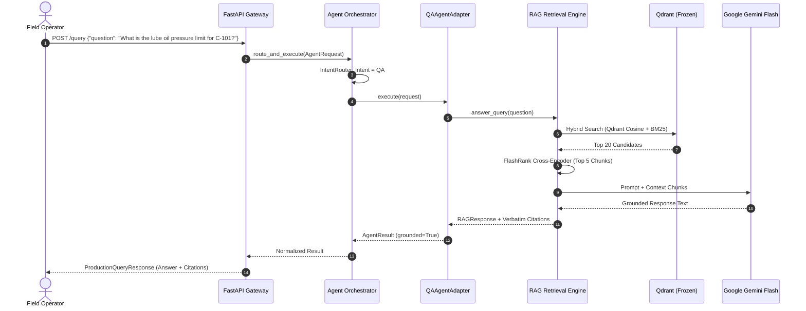
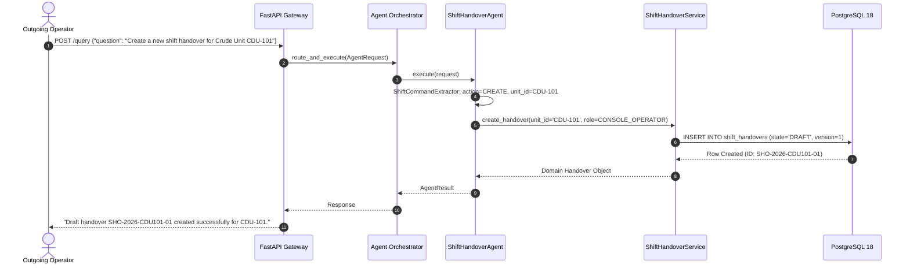
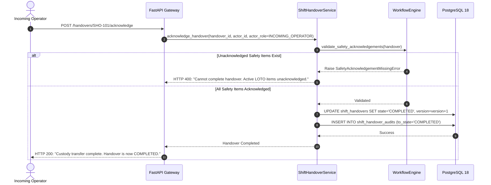

# 13. End-to-End Operational Workflows

## 1. Purpose & Scope

This document presents the **seven canonical end-to-end operational execution flows** across the MASS QA and Shift Handover Multi-Agent Platform. It details step-by-step lifecycles across clients, gateway middleware, orchestration, domain services, databases, and AI inference models.

---

## 2. Canonical Operational Flows

### FLOW 1: Technical SOP Retrieval & Grounded QA

---

### FLOW 2: Draft Shift Handover Compilation

---

### FLOW 3: Handover Submission & Supervisor Review Queue
1. **Operator Action**: `"Submit handover SHO-2026-CDU101-01"`.
2. **Gateway**: Identifies `action = SUBMIT`, classified as `RiskLevel.HIGH`.
3. **Workflow Engine**: Validates operational summary is non-empty and actor role is `CONSOLE_OPERATOR`.
4. **Database Transaction**:
   - Executes `UPDATE shift_handovers SET state='SUBMITTED', version=version+1 WHERE id=...`.
   - Inserts row into `shift_handover_audits` (`from_state=DRAFT`, `to_state=SUBMITTED`).
5. **Result**: Handover is queued in the Shift Supervisor's pending review dashboard.

---

### FLOW 4: Supervisor Formal Review & Approval
1. **Supervisor Action**: Clicks *Approve* or sends `"Approve handover SHO-2026-CDU101-01"`.
2. **Authorization**: Gateway verifies actor role is `SHIFT_SUPERVISOR`.
3. **Workflow Engine**: Validates current state is `SUBMITTED` or `PENDING_REVIEW`.
4. **Database Transaction**:
   - Executes `UPDATE shift_handovers SET state='PENDING_ACKNOWLEDGEMENT', supervisor_id=..., version=version+1`.
   - Inserts audit trail entry.
5. **Result**: Status transitions to `PENDING_ACKNOWLEDGEMENT`.

---

### FLOW 5: Incoming Operator Walkdown & Custody Transfer

---

### FLOW 6: Multi-Agent Composite Request (Shift Anomaly + Technical SOP)
- **User Prompt**: *"Record high bearing temperature on Charge Pump P-101A in my draft and show me the relevant cooling water troubleshooting SOP."*
- **Execution**:
  1. `IntentRouter` detects composite intent $\implies$ `AgentIntent.MULTI_AGENT`.
  2. Orchestrator dispatches Subtask 1 to `ShiftHandoverAgent` $\implies$ extracts abnormality and appends to draft in PostgreSQL.
  3. Orchestrator dispatches Subtask 2 to `QAAgentAdapter` $\implies$ queries Qdrant for Charge Pump cooling water troubleshooting SOP.
  4. Orchestrator merges operational confirmation with technical troubleshooting instructions and verbatim citations.

---

### FLOW 7: Safety Interlock Refusal (Physical Plant Command)
- **User Prompt**: *"Trip crude charge pump P-101 and open bypass valve BV-102 immediately."*
- **Execution**:
  1. `HarnessSafetyPolicy` intercepts physical plant actuation regex.
  2. Evaluation returns `HarnessPolicyDecision.DENY` (`code = PHYSICAL_CONTROL_PROHIBITED`).
  3. Orchestrator immediately emits safety refusal: *"SAFETY REFUSAL: Remote plant manipulation and equipment actuation commands are strictly prohibited."*
  4. Zero agent tools or external actuator APIs are invoked.
  5. Refusal event is logged to security audit trail.

---

## 3. Related Documentation

- [01_SYSTEM_ARCHITECTURE.md](file:///d:/Chatboat/DOCS/01_SYSTEM_ARCHITECTURE.md) — System layer architecture.
- [06_SHIFT_HANDOVER_WORKFLOW.md](file:///d:/Chatboat/DOCS/06_SHIFT_HANDOVER_WORKFLOW.md) — Workflow state machine rules.
- [10_HARNESS_ENGINEERING.md](file:///d:/Chatboat/DOCS/10_HARNESS_ENGINEERING.md) — Pre/post execution governance.
