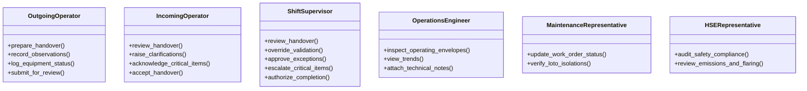
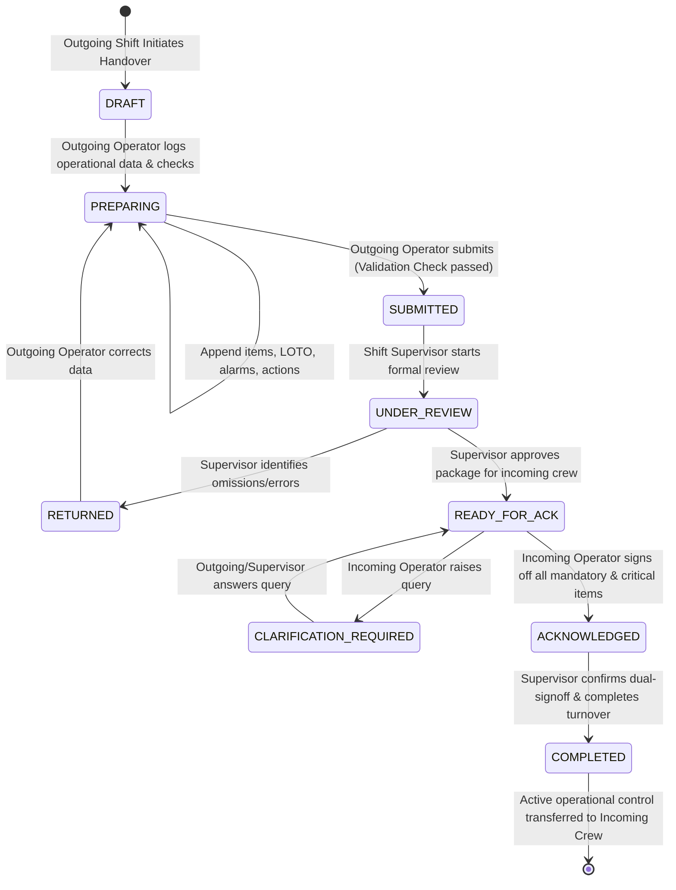
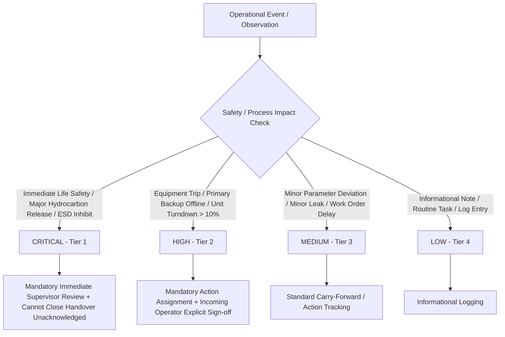
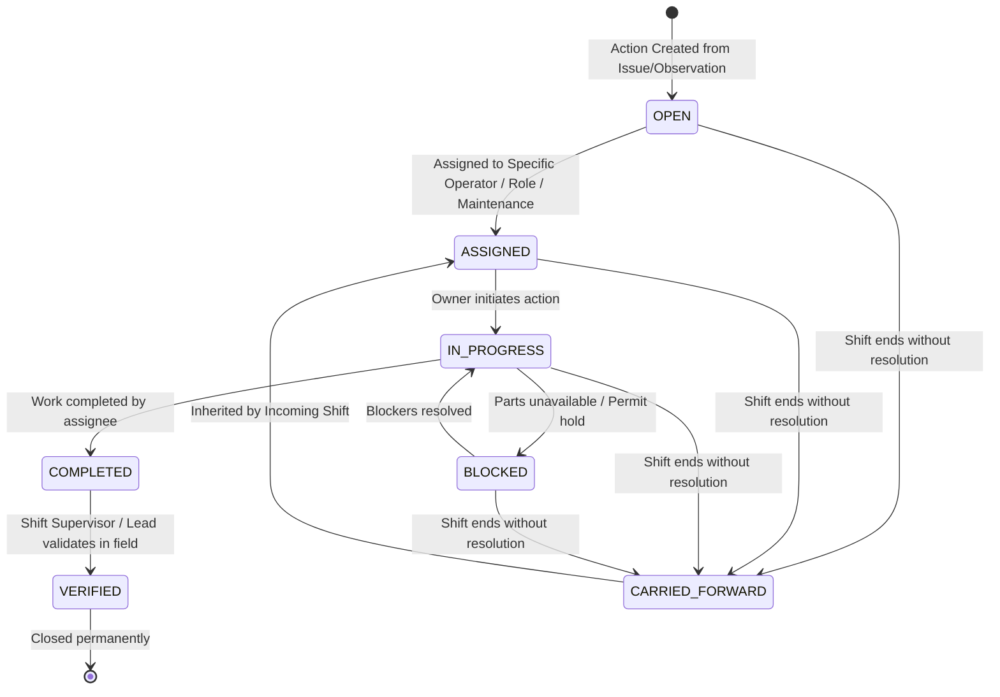
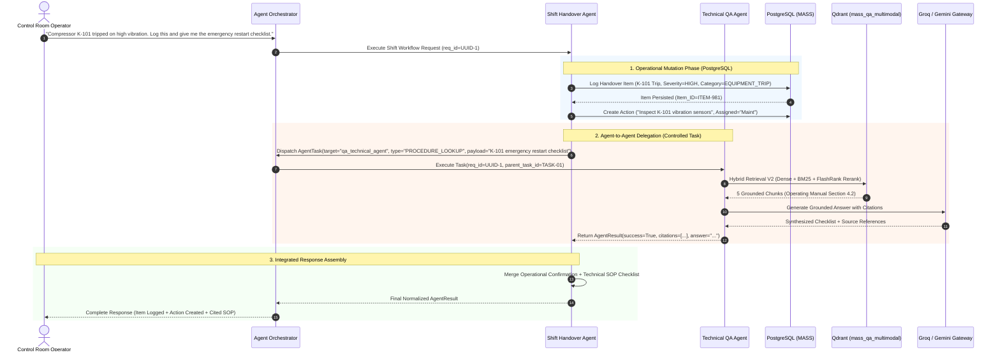
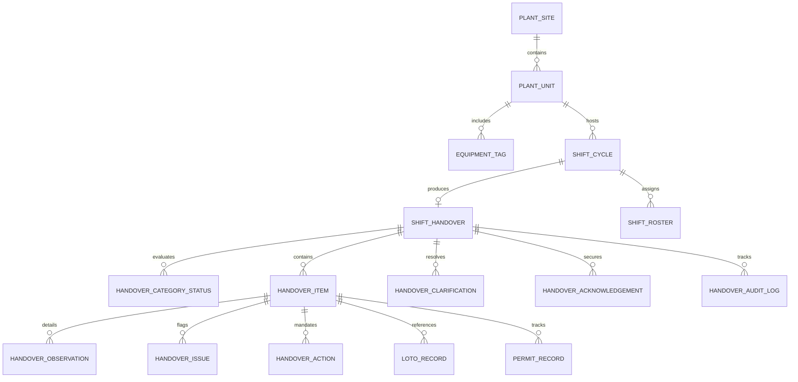

# MASS QA / Shift Handover Platform
# STEP 3: Production-Grade Oil & Gas Shift Handover Business Workflow Design

> **Document Version:** 1.0.0  
> **Status:** APPROVED DESIGN (Pre-Implementation Baseline)  
> **Classification:** Engineering & Operational Architecture Standard  
> **Target Environment:** Industrial Oil & Gas Refining, Gas Processing, and Petrochemical Plants  
> **Next Step:** STEP 4 — PostgreSQL Schema, SQLAlchemy 2.0 Domain Models, Alembic Migrations & Service Layer  

---

## Executive Summary & System Objectives

Shift changeover in upstream, midstream, and downstream Oil & Gas facilities represents the highest-risk operational period for safety incidents, loss of containment, unplanned trips, and regulatory non-compliance (API RP 755, OSHA 1910.119 PSM). 

The objective of the **MASS Shift Handover Subsystem** is to transform unstructured, error-prone verbal and fragmented logbook communications into a **rigorously governed, structured, auditable, and AI-augmented operational workflow**.

```text
                     INDUSTRIAL OPERATIONAL DOMAIN
                                   │
               ┌───────────────────┴───────────────────┐
               ▼                                       ▼
    POSTGRESQL RELATIONAL ENGINE            QDRANT VECTOR ENGINE
    (Operational / Transactional)           (Engineering / Technical Knowledge)
    • Shifts & Handover Cycles             • 2,079 Process Vectors
    • Unit Operational Status               • Equipment Manuals & Data Sheets
    • LOTO & Permit Boundaries              • Operating Envelopes (SOL/IOW)
    • Observations & Abnormalities          • Emergency Operating Procedures (EOP)
    • Actions & Carry-Forwards              • Standard Operating Procedures (SOP)
    • Cryptographic Audit Trail             • Grounded Citations & Evidence
```

---

## 1. Actor Model & Role-Based Operational Matrix

In an operating hydrocarbon refinery or gas plant, shift handover involves defined operational personas with distinct legal and operational responsibilities.



### Detailed Actor Matrix

| Actor Role | Primary Responsibilities | Read Permissions | Write Permissions | Approval Authority | Escalation Authority |
| :--- | :--- | :--- | :--- | :--- | :--- |
| **Outgoing Operator** (Panel / Field) | Logs unit parameters, alarms, trip bypasses, equipment abnormalities, LOTO status, ongoing permits, and creates initial draft. | Full Shift & Unit History | Draft, Edit Handover Items, Log Observations, Propose Actions | None | Operational deviations to Shift Supervisor |
| **Incoming Operator** (Panel / Field) | Conducts panel/field inspection, cross-examines log, seeks clarifications, verifies physical plant matches record, formally acknowledges risks. | Full Shift & Historical Logs | Add Clarification Notes, Acknowledge Items, Accept Handover | Formal Handover Acceptance | Refusal to accept unsafe unit to Supervisor |
| **Shift Supervisor** | Responsible for safe continuity of the entire operating area/complex. Reviews critical items, validates safety margins, authorizes handover. | All Units, Plant-Wide Audit Trail | Return Handover, Override Non-Critical Blocks, Reassign Actions | Authorize Handover Completion, Approve Carry-Forwards | Immediate escalation to Operations Manager / Plant Super |
| **Operations / Process Engineer** | Monitors Safe Operating Limits (SOL) and Integrity Operating Windows (IOW), assists in troubleshooting. | Read-Only Operational & Knowledge Data | Attach Process Recommendations, Append Technical Notes | None | Process Safety deviations to Technical Authority |
| **Maintenance Lead / Coordinator** | Updates equipment availability, LOTO tags, ongoing PM/CM work orders, hot work/confined space status. | Work Orders, Equipment Logs | Update Equipment Operational Flag, Update LOTO/Permit Status | Maintenance Handback Verification | Maintenance delay / Part unavailability |
| **HSE Representative** | Audits regulatory compliance, flaring limits, chemical releases, permit-to-work audits, safety system impairments. | Plant-Wide Environmental & Safety Logs | Append HSE Directives, Flag Compliance Deviations | Safety Stop-Work Authority | Direct escalation to Plant Manager & Regulatory |
| **System / Admin** | Platform maintenance, RBAC mapping, vector store integrity, Logfire telemetry, database maintenance. | System Audit Logs, Telemetry | Manage User Roles, Service Configurations | None | Platform Outage Notifications |

---

## 2. Shift Definition & Hierarchical Context

A **Shift** represents a bounded operating duration (typically 8-hour or 12-hour rotation) for a defined plant asset.

### Plant Asset Hierarchy
```text
Enterprise (e.g., National Energy Corp)
 └── Site / Complex (e.g., Ras Tanura Refinery Complex)
      └── Plant (e.g., Crude Distillation & Hydrotreating Plant 01)
           └── Operating Area / Unit (e.g., CDU-101 / Atmospheric Distillation Unit)
                └── Equipment Train / Sub-Unit (e.g., Atmospheric Overhead Condensing System)
                     └── Tagged Equipment Asset (e.g., P-101A/B Crude Charge Pumps)
```

### Shift Object Specification
* **`shift_id`**: UUID v4 (Unique operating cycle identifier).
* **`plant_site_id`**: String code (e.g., `PLANT-KBO-01`).
* **`area_unit_id`**: String code (e.g., `UNIT-CDU-101`).
* **`shift_type`**: Enum (`DAY_SHIFT_12H` [06:00-18:00], `NIGHT_SHIFT_12H` [18:00-06:00], `EARLY_8H`, `SWING_8H`, `GRAVE_8H`).
* **`start_time_utc`**: UTC Timestamp.
* **`end_time_utc`**: UTC Timestamp.
* **`outgoing_crew_id`**: Crew identifier (e.g., `CREW-ALPHA`).
* **`incoming_crew_id`**: Crew identifier (e.g., `CREW-BRAVO`).
* **`supervisor_user_id`**: Foreign key to `User.id` of designated Shift Supervisor.
* **`status`**: Enum (`PLANNED`, `ACTIVE`, `HANDOVER_ACTIVE`, `CLOSED`, `ARCHIVED`).

---

## 3. Formal Shift Handover Lifecycle & State Machine

The handover process follows a deterministic finite state machine (FSM). State transitions require role authorization, invariant validation, and automated audit logging.



### State Transition Logic & Validation Invariants

| State | Entry Condition | Authorized Actor | Validation Invariants Required | Exit Trigger | Next State |
| :--- | :--- | :--- | :--- | :--- | :--- |
| **`DRAFT`** | System cron or manual trigger 2 hours prior to shift end. | Outgoing Operator / Supervisor | Valid active shift ID; user belongs to outgoing crew. | User begins entering logs. | `PREPARING` |
| **`PREPARING`** | Continuous logging during shift duration. | Outgoing Crew, Panel/Field Operators | Unit status filled; all critical alarms acknowledged; equipment tags verified. | Submit Handover Action. | `SUBMITTED` |
| **`SUBMITTED`** | Outgoing signoff of initial report. | Outgoing Lead Operator | No empty required categories; all open trips have recorded cause; all bypasses documented. | Supervisor opens review. | `UNDER_REVIEW` |
| **`UNDER_REVIEW`** | Supervisor review stage. | Shift Supervisor | Verification of operating envelopes (SOL/IOW) and compliance with environmental flaring limits. | Supervisor Decision (Approve / Return). | `READY_FOR_ACK` or `RETURNED` |
| **`RETURNED`** | Supervisor rejection. | Shift Supervisor | Rejection comment/reason is mandatory (min 15 chars). | Outgoing Operator edits items. | `PREPARING` |
| **`READY_FOR_ACK`**| Package approved for incoming crew. | Shift Supervisor | All critical items flagged; open actions carry forward reference valid. | Incoming Operator opens package. | `CLARIFICATION_REQUIRED` or `ACKNOWLEDGED` |
| **`CLARIFICATION_REQUIRED`**| Incoming operator flags ambiguity. | Incoming Operator | Specific item referenced with typed question. | Outgoing Operator answers. | `READY_FOR_ACK` |
| **`ACKNOWLEDGED`**| Incoming operator sign-off. | Incoming Lead Operator | Physical confirmation checkbox checked; cryptographic digital signoff; all CRITICAL items acknowledged individually. | Supervisor final completion signoff. | `COMPLETED` |
| **`COMPLETED`** | Final turnover of custody. | Shift Supervisor | Both Outgoing and Incoming signatures validated; timestamped in UTC; notifications dispatched. | None (Terminal state). | `ARCHIVED` |

---

## 4. Structured Handover Content Model

To avoid dangerous ambiguity, handover content is strictly categorized into operational domains matching petrochemical standards:

```text
HANDOVER PACKAGE (UNIT / AREA LEVEL)
 ├── 1. Executive Operations & Production Summary
 │     ├── Unit Operational Mode (Normal Operation / Turndown / Startup / Shutdown / Emergency)
 │     ├── Feed Rate, Processing Throughput, Yields & Target Deviations
 │     └── Product Quality / Off-Spec Dispositions (Lab Results & Online Analyzers)
 ├── 2. Process Integrity & Safety Systems (PSM / Critical)
 │     ├── Active Critical Alarms & Inhibit/Bypass Log (with MOC References)
 │     ├── Relief Valve / Flare Discharges & Atmospheric Emissions
 │     └── Emergency Shutdown (ESD) / Fire & Gas System Status
 ├── 3. Equipment Reliability & Maintenance
 │     ├── Rotating Equipment Health (Vibration, Bearing Temp, Lube Oil)
 │     ├── Static Equipment & Piping (Leaks, Corrosion, Hot Spots)
 │     ├── Lock-Out / Tag-Out (LOTO) & Electrical Isolations Active
 │     └── Active Permits to Work (Hot Work, Confined Space, Working at Heights)
 ├── 4. Operational Observations & Abnormalities
 │     ├── Field Operator Rounds Observations
 │     ├── Control Room Panel Deviations & Instrument Faults
 │     └── Utilities & Grid Stability (Steam, Instrument Air, Power, Nitrogen)
 └── 5. Action Items & Work Orders
       ├── Immediate Handover Actions (Next 2-4 hours)
       ├── Routine Maintenance Follow-Ups
       └── Carried-Forward Unresolved Items from Prior Shifts
```

---

## 5. Criticality Classification & Operational Severity Engine

Severity is deterministically enforced using industrial criteria rather than arbitrary LLM generation:



### Severity Definitions

| Severity | Operational Criteria | Workflow Constraints | Human-in-the-Loop Rules |
| :--- | :--- | :--- | :--- |
| **`CRITICAL`** | • Immediate personnel safety hazard.<br>• Uncontrolled toxic/flammable gas release ($H_2S, LEL$).<br>• Safety Critical Equipment (SCE) offline or ESD bypassed.<br>• Unit operating outside Safe Operating Limits (SOL). | • **Blocks handover completion** unless formally reviewed and signed off by Shift Supervisor.<br>• Requires explicit individual sign-off by Incoming Operator.<br>• Generates emergency notification. | AI **cannot** downgrade severity. Supervisor override requires documented rationale. |
| **`HIGH`** | • Redundant backup pump/compressor unavailable (loss of N+1).<br>• Product quality off-spec risking tank contamination.<br>• Active permit on energized high-voltage line. | • Requires assigned action with due time.<br>• Incoming operator must acknowledge before completion. | AI can suggest mitigation; Operator confirms classification. |
| **`MEDIUM`** | • Minor instrument drift (e.g., flow transmitter error < 3%).<br>• Minor gland packing steam leak.<br>• Non-urgent routine maintenance pending. | • Normal carry-forward action.<br>• Standard batch review. | Operator editable. |
| **`LOW`** | • Informational log entry, routine sampling completed, shift housekeeping. | • Archived with shift summary. | Standard logging. |

---

## 6. Entity Model: Observations vs. Issues vs. Incidents vs. Actions

A key defect in legacy systems is conflating an observation with a corrective action or an incident. We establish clean operational boundaries:

```text
Observation (What was seen) ──► Issue (Why it matters / Condition) ──► Action (What to do about it)
                                         │
                                         ▼ (If threshold exceeded)
                                      Incident (Formal HSE / PSM Event)
```

1. **Observation (`HandoverObservation`)**: A factual event, sensor reading, or field inspection note captured by an operator (e.g., *"P-101B inboard bearing vibration peaked at 4.8 mm/s during tank switchover"*).
2. **Issue (`HandoverIssue`)**: An abnormal condition requiring engineering/operational attention (e.g., *"P-101B approaching vibration trip threshold; backup pump P-101A is isolated under LOTO"*).
3. **Incident (`OperationalIncident`)**: A formal operational or HSE event involving regulatory reporting, loss of containment, or emergency shutdown (e.g., *"CDU-101 vacuum column overhead PSV-104 lifted at 14:22 UTC"*).
4. **Action (`HandoverAction`)**: A discrete, assignable task with single ownership, priority, target completion time, and verification lifecycle.

---

## 7. Action Management & Carry-Forward Lifecycle

Actions follow an independent sub-state machine to ensure zero dropped tasks across shift rotations.



### Carry-Forward Lineage Architecture

When Shift A closes with uncompleted actions:
1. The original action record (`Action A-001`) remains intact with `origin_shift_id = Shift_A`.
2. A foreign-key link `current_shift_id` is updated to `Shift_B`.
3. The carry-forward count increments (`carry_forward_count = carry_forward_count + 1`).
4. If an action is carried forward $> 3$ consecutive shifts, an **Automated Operational Escalation** is triggered to Area Operations Management.

---

## 8. Acknowledgement & Dual-Custody Sign-Off Protocol

Acknowledgement in a hazardous facility is a legal transfer of custody.

### Acknowledgement Invariants
* **Non-Repudiation**: Captured with authenticated `user_id`, role, client IP, UTC timestamp, and SHA-256 integrity hash of the handover payload.
* **Itemized Critical Sign-Off**: The incoming operator must individually check off every item marked `CRITICAL` or `HIGH` before the global "Accept Handover" button is unlocked.
* **Clarification Resolution**: If any item has an active thread in `CLARIFICATION_REQUIRED`, handover completion is hard-blocked until the outgoing crew or supervisor posts an answer.

---

## 9. Handling Exceptions & Anomalous Conditions

```text
OPERATIONAL EXCEPTION PATHWAYS
 ├── 1. Incomplete Handover Data
 │     ├── Rule: If mandatory categories are missing, system returns validation errors with specific missing fields.
 │     └── Override: Only Shift Supervisor can execute "Emergency Incomplete Submission" with documented reason.
 ├── 2. Outgoing Shift Delayed / Evacuated (Emergency Turnover)
 │     ├── Rule: If outgoing crew is incapacitated or in muster zone, Shift Supervisor takes direct custody.
 │     └── Audit: Flagged as "SUPERVISOR_PROXY_TAKEOVER" with mandatory incident link.
 ├── 3. Incoming Crew Delayed (Shift Holdover)
 │     ├── Rule: Outgoing crew remains on duty; shift status transitions to "EXTENDED_HOLD".
 │     └── Rule: Handover cannot be accepted by an incoming crew member who has not badged into the control room.
 └── 4. Disputed Handover / Unsafe Condition
       ├── Rule: Incoming Operator clicks "Refuse Handover" specifying safety risk.
       └── Action: Immediate alarm generated to Operations Manager; unit remains under joint observation.
```

---

## 10. Multi-Agent Architecture: QA Agent ↔ Shift Handover Agent

The system orchestrates two specialized agents with strict separation of concerns.



### Strict Agent Separation Rules
1. **Zero Direct Vector Access for Shift Agent**: The Shift Agent **never** queries or modifies Qdrant directly. All knowledge retrieval must go through the QA Agent via an `AgentTask`.
2. **Zero Relational Mutation for QA Agent**: The QA Agent **never** modifies shift logs, creates actions, or alters database state. It is strictly a read-only grounding engine.
3. **Controlled Inter-Agent Contract**: Agent-to-agent communication is mediated via the `AgentOrchestrator` using strongly-typed `AgentTask` objects with strict timeouts (max 20 seconds).

---

## 11. Agent Task Specification (Inter-Agent Delegation)

```python
class AgentTaskType(str, Enum):
    PROCEDURE_LOOKUP = "PROCEDURE_LOOKUP"
    EQUIPMENT_SPEC_LOOKUP = "EQUIPMENT_SPEC_LOOKUP"
    SAFETY_GUIDELINE_LOOKUP = "SAFETY_GUIDELINE_LOOKUP"
    OPERATING_LIMIT_CHECK = "OPERATING_LIMIT_CHECK"
    HISTORICAL_SHIFT_SEARCH = "HISTORICAL_SHIFT_SEARCH"

class AgentTask(BaseModel):
    task_id: str = Field(default_factory=lambda: str(uuid.uuid4()))
    parent_task_id: Optional[str] = None
    request_id: str
    source_agent: str = "shift_handover_agent"
    target_agent: str = "qa_technical_agent"
    task_type: AgentTaskType
    payload: Dict[str, Any]  # e.g., {"query": "...", "equipment_tag": "K-101"}
    timeout_seconds: float = 20.0
    created_at: datetime = Field(default_factory=lambda: datetime.now(timezone.utc))
```

---

## 12. Human-in-the-Loop Authority & Guardrails

The AI is an operational assistant, not an autonomous plant operator.

```text
┌─────────────────────────────────────────────────────────────────────────┐
│                     AI CAPABILITY PERMISSION BOUNDARIES                 │
├─────────────────────────────────────────┬───────────────────────────────┤
│ WHAT THE AI CAN DO                      │ WHAT THE AI MUST NEVER DO     │
├─────────────────────────────────────────┼───────────────────────────────┤
│ • Parse natural language operator notes │ • Autonomously approve shifts │
│ • Extract equipment tags & parameters   │ • Close safety critical items │
│ • Propose severity classifications      │ • Modify physical LOTO tags   │
│ • Identify missing mandatory categories │ • Change equipment run states │
│ • Retrieve cited SOPs & checklists      │ • Override safety alarms      │
│ • Draft shift executive summaries       │ • Fabricate telemetry data    │
│ • Remind operators of overdue actions   │ • Execute autonomous plant IO │
└─────────────────────────────────────────┴───────────────────────────────┘
```

---

## 13. Conceptual Entity-Relationship Architecture (PostgreSQL)

> *Note: This represents the conceptual domain model for review prior to writing SQLAlchemy code in Step 4.*



### Core Domain Entities

1. **`ShiftCycle`**: Operational rotation instance (plant, area, crew, start/end time, status).
2. **`ShiftHandover`**: Main handover record, state machine tracker, version, completion flags.
3. **`HandoverCategoryStatus`**: Quantitative status of core modules (feed, production, safety, flaring).
4. **`HandoverItem`**: Granular entry linked to an equipment tag, system area, category, and severity.
5. **`HandoverAction`**: Corrective action tracking assignee, due time, status, and carry-forward lineage.
6. **`LotoRecord`**: Active lock-out/tag-out isolation points and isolation certificate numbers.
7. **`PermitRecord`**: Active work permits (Hot Work, Cold Work, Confined Space, Radiography).
8. **`HandoverClarification`**: Threaded Q&A between incoming and outgoing crews prior to sign-off.
9. **`HandoverAcknowledgement`**: Cryptographic sign-off records for incoming operators and supervisors.
10. **`HandoverAuditLog`**: Append-only tamper-evident audit record of every state transition.

---

## 14. Formal Business Rules Matrix (BR-001 to BR-030)

| Rule ID | Business Rule Statement | Target Actor | Invariant / Validation | System Enforcement |
| :--- | :--- | :--- | :--- | :--- |
| **BR-001** | Only authenticated members of the outgoing crew can draft and submit a handover. | Outgoing Operator | `user.crew_id == shift.outgoing_crew_id` | HTTP 403 Forbidden on mismatch |
| **BR-002** | A handover cannot transition from `PREPARING` to `SUBMITTED` if required operational categories are empty. | Outgoing Operator | `check_mandatory_categories_filled()` | Blocks submission; returns missing fields |
| **BR-003** | Any event involving ESD trips, toxic leaks, or SCE unavailability must be flagged as `CRITICAL`. | All Users / AI | `if is_sce_impaired: severity == CRITICAL` | Enforced at service layer |
| **BR-004** | A handover with active `CRITICAL` items cannot be completed without explicit Shift Supervisor sign-off. | Shift Supervisor | `count(critical_unreviewed) == 0` | Hard validation block on `COMPLETED` |
| **BR-005** | Incoming operators must individually acknowledge every `CRITICAL` and `HIGH` item before global acceptance. | Incoming Operator | `item_acknowledgements.count() == critical_items.count()` | UI unlock condition & backend guard |
| **BR-006** | The Shift Supervisor cannot approve their own submitted handover (Dual-Control Principle). | Shift Supervisor | `handover.submitted_by != supervisor.user_id` | Hard authorization barrier |
| **BR-007** | An AI Agent is strictly prohibited from signing, approving, or completing any handover workflow step. | AI Subsystem | `actor.is_ai == False` for all mutations | Service level check |
| **BR-008** | All unresolved actions from the previous shift must automatically carry forward with lineage preserved. | System Engine | `current_shift_id = new_shift.id, lineage_count += 1` | Automated rollover engine |
| **BR-009** | If an action is carried forward $> 3$ consecutive shifts, an automated escalation flag must be raised. | System Engine | `if carry_forward_count >= 3: is_escalated = True` | Escalation audit log & notification |
| **BR-010** | All timestamps must be generated and stored in UTC; plant local timezone is applied only at presentation. | System Engine | `datetime.now(timezone.utc)` | Database schema constraint |
| **BR-011** | Modifying a submitted handover is prohibited; any changes require the Supervisor to return the package to `PREPARING`. | All Users | `handover.status == PREPARING` for edits | Immutability lock in database |
| **BR-012** | Every state transition must generate an immutable record in `HandoverAuditLog`. | System Engine | Transactional append with state diff | Enforced in database transaction |
| **BR-013** | Handover submission and completion endpoints must be idempotent using unique client request IDs. | Client / API | `request_id` idempotency key checked against cache/DB | Prevents duplicate submissions |
| **BR-014** | Handover items referencing equipment must validate the tag against registered `EquipmentTag` entries. | System Engine | `equipment_tag in valid_plant_tags` | Warning / validation check |
| **BR-015** | Active LOTO isolations cannot be removed from the handover log until physical de-isolation is verified. | Maintenance / Operator | `loto.status == DE_ISOLATED` | Hard check against active LOTO registry |
| **BR-016** | Active Hot Work permits in hydrocarbon areas must be explicitly flagged to incoming panel operators. | Safety Lead | `permit.type == HOT_WORK -> requires_panel_flag` | High visibility badge in UI |
| **BR-017** | Shift Handover Agent communication with Technical QA Agent must timeout after 20 seconds. | Orchestrator | `timeout = 20.0s` | Circuit breaker triggers safe fallback |
| **BR-018** | Technical QA Agent is strictly read-only and has zero write permissions to PostgreSQL operational tables. | QA Agent | DB role has only `SELECT` permissions on reference data | Database RBAC constraint |
| **BR-019** | Shift Handover Agent has zero direct access to Qdrant vector collections. | Shift Agent | Qdrant client isolated in QA service | Architectural isolation |
| **BR-020** | Clarification questions raised by incoming operators block handover completion until answered. | Incoming / Outgoing | `count(unresolved_clarifications) == 0` | State machine block |
| **BR-021** | Handover packages must be archived with SHA-256 tamper-evident payload hashes upon completion. | System Engine | `hash = sha256(serialize(handover))` | Stored in completion record |
| **BR-022** | Concurrent edits to the same handover package must be prevented via Optimistic Concurrency Control (`version_id`). | System Engine | `WHERE version_id = :expected_version` | HTTP 409 Conflict on stale update |
| **BR-023** | Operators cannot be assigned actions unless they have an active user profile in the target plant/unit. | Shift Lead | `assignee.plant_id == handover.plant_id` | Foreign key validation |
| **BR-024** | Supervisor override of an incomplete handover requires a documented justification of at least 30 characters. | Shift Supervisor | `len(override_justification) >= 30` | Validation rule on override |
| **BR-025** | Emergency Handover mode (e.g., plant evacuation) transfers full signing authority to Shift Supervisor. | Shift Supervisor | `emergency_mode == True` logged in audit | Emergency protocol activation |
| **BR-026** | Outgoing operators who hold active Work Permits must surrender or transfer permit custody before handover sign-off. | Outgoing Operator | `count(active_permits_held) == 0` | Pre-submission validation check |
| **BR-027** | Safety Critical Alarms bypassed during the shift must have an associated Management of Change (MOC) number. | Control Room Operator | `if alarm.bypassed: assert alarm.moc_number is not None` | Compliance validation check |
| **BR-028** | Handover session memory must expire after 24 hours to prevent stale context bleeding into future shifts. | Redis / Cache | `TTL = 86400s` | Cache eviction policy |
| **BR-029** | LLM temperature for all operational summaries and extraction must be fixed at 0.0 (Zero Hallucination). | Gateway | `temperature = 0.0` | Gateway configuration rule |
| **BR-030** | Incoming shift cannot accept handover if total active toxic gas detectors in fault mode exceeds area threshold ($> 1$). | HSE / Operator | `count(faulty_gas_detectors) <= 1` | Safety interlock rule |

---

## 15. Operational Scenarios & Traceable Conversational Flows

### Scenario 1: Logging an Equipment Anomaly & Delegating SOP Retrieval to QA Agent

```text
[OPERATOR]
"Compressor K-101 tripped on 2nd stage high discharge temperature (165°C). 
 I've put the unit in recycle. Add this to the handover as High priority, 
 assign an inspection action to Mechanical Maintenance for tomorrow morning, 
 and show me the approved restart procedure."

[AGENT ORCHESTRATOR]
  ├── Intent: SHIFT_HANDOVER (with embedded Technical QA lookup)
  └── Dispatches to: Shift Handover Agent (req_id = 9b1deb4d-3b7d-4bad-9bdd-2b0d7b3dcb6d)

[SHIFT HANDOVER AGENT]
  ├── 1. Validates Operator Context (Plant: Refinery-01, Unit: Gas-Plant-02, User: Op-712)
  ├── 2. Executes Controlled Relational Mutation (PostgreSQL):
  │     • Creates HandoverItem:
  │       - Category: EQUIPMENT_TRIP
  │       - Title: "K-101 2nd Stage High Discharge Temperature Trip (165°C)"
  │       - Severity: HIGH
  │       - Equipment Tag: "K-101"
  │       - Status: OPEN
  │     • Creates HandoverAction:
  │       - Title: "Inspect K-101 2nd stage valves and coolers"
  │       - Assignee Group: "MECHANICAL_MAINTENANCE"
  │       - Target Completion: "Tomorrow 08:00 UTC"
  │       - Status: ASSIGNED
  ├── 3. Constructs Inter-Agent Delegation Task (AgentTask):
  │     • Target: qa_technical_agent
  │     • Task Type: PROCEDURE_LOOKUP
  │     • Payload: {"query": "K-101 compressor high discharge temperature restart procedure", "tag": "K-101"}
  └── 4. Dispatches via Orchestrator to QA Agent

[QA AGENT]
  ├── 1. Receives AgentTask
  ├── 2. Executes Hybrid Retrieval V2 on Qdrant (mass_qa_multimodal):
  │     • Dense Semantic Vector Search + BM25 Sparse Search + RRF Fusion
  │     • FlashRank Cross-Encoder Reranking
  ├── 3. Retrieves Grounded Chunks from Operating Manual Section 7.4 (Doc: GP-SOP-K101-REV3.pdf, Pages 42-44)
  ├── 4. Synthesizes Grounded Answer with Evidence Grounding Guardrails
  └── 5. Returns AgentResult to Shift Handover Agent with Source Citations

[SHIFT HANDOVER AGENT]
  ├── Merges transactional DB confirmations with technical procedure answer.
  └── Emits Final Response:

"✅ **Logged to Shift Handover (Item #ITEM-412)**
• **Equipment:** K-101 (2nd Stage Discharge)
• **Severity:** HIGH (Trip at 165°C, Unit in Recycle)
• **Action Created:** Assigned to `MECHANICAL_MAINTENANCE` for tomorrow 08:00 UTC.

📚 **Approved K-101 Restart Procedure (SOP-GP-K101, Rev 3, Page 42)**
Before initiating motor restart:
1. Verify 2nd stage suction and discharge isolation valves are aligned to recycle header.
2. Confirm jacket cooling water flow indicator FI-1012 reads > 15 m³/h.
3. Check lube oil temperature is between 40°C - 50°C and pressure > 2.5 bar.
4. Manually bar over the compressor shaft minimum 2 full revolutions to ensure no mechanical binding.
5. Obtain Shift Supervisor permit clearance prior to resetting panel alarm LAH-1012.

*Verified Sources: [1] GP-SOP-K101-REV3.pdf (Page 42) [TEXT]*"
```

---

## 16. Concurrency, Idempotency & Timezone Architectures

### Optimistic Concurrency Control (OCC)
To protect against lost updates when multiple board/field operators update the same handover package simultaneously:
* Every `ShiftHandover` and `HandoverItem` entity possesses an integer column `version_id`.
* Every mutation executes:
  ```sql
  UPDATE shift_handovers 
  SET status = :new_status, version_id = version_id + 1, updated_at = :utc_now
  WHERE id = :handover_id AND version_id = :current_version_id;
  ```
* If zero rows are updated, an `OptimisticLockError` is thrown, returning HTTP `409 Conflict` with the latest server state to the client.

### Idempotent API Execution
All state-modifying requests (`POST /shift/handover/submit`, `POST /shift/handover/acknowledge`, `POST /shift/actions`) require a client-generated UUID `Idempotency-Key` header:
* Stored in Redis with 120-second TTL.
* If a retry arrives with an identical key during processing, the second request safely blocks or returns the cached response, preventing duplicate records.

### Timezone & Temporal Precision
* **Internal Canonical Standard**: 100% UTC (`TIMESTAMPTZ` in PostgreSQL, `datetime.now(timezone.utc)` in Python).
* **Display Conversion**: Client headers supply `X-Plant-Timezone` (e.g., `Asia/Riyadh`, `America/Houston`), where formatting occurs strictly at the edge UI layer.

---

## 17. Security Architecture & RBAC Mapping

The Shift Handover Subsystem integrates directly into the existing JWT and User infrastructure established in Step 1 & 2.

```text
JWT Claims
 ├── sub: "user-uuid"
 ├── role: "OPERATOR" | "SUPERVISOR" | "ENGINEER" | "ADMIN"
 ├── plant_id: "PLANT-01"
 └── permissions: [
       "shift.read",
       "shift.draft",
       "shift.submit",
       "shift.review",
       "shift.acknowledge",
       "shift.complete",
       "shift.escalate",
       "action.assign"
     ]
```

### Permission Enforcement Points
* **Endpoint Level**: FastAPI `Depends(require_role([...]))` and `Depends(require_permission("shift.review"))`.
* **Row-Level Security (RLS)**: Users can only view and mutate handovers belonging to their assigned plant and operating units.

---

## 18. Implementation-Readiness Checklist & Handover to Step 4

```text
================================================================================
STEP 3 STATUS REPORT: PRODUCTION BUSINESS WORKFLOW DESIGN
================================================================================

Business Workflow:
  STATUS: READY FOR STEP 4 IMPLEMENTATION

Actors Defined:
  • Outgoing Operator (Panel & Field)
  • Incoming Operator (Panel & Field)
  • Shift Supervisor
  • Operations / Process Engineer
  • Maintenance Representative
  • HSE Representative
  • System Administrator

Handover States Formalized:
  • DRAFT
  • PREPARING
  • SUBMITTED
  • UNDER_REVIEW
  • RETURNED
  • READY_FOR_ACK
  • CLARIFICATION_REQUIRED
  • ACKNOWLEDGED
  • COMPLETED
  • ARCHIVED

Core Conceptual Entities:
  • ShiftCycle
  • ShiftHandover
  • HandoverCategoryStatus
  • HandoverItem
  • HandoverObservation
  • HandoverIssue
  • HandoverAction
  • LotoRecord
  • PermitRecord
  • HandoverClarification
  • HandoverAcknowledgement
  • HandoverAuditLog

Critical Business Rules:
  • BR-001 through BR-030 formally specified with automated invariant checks.

Human Approval Points:
  • Supervisor Handover Package Review (Entry to READY_FOR_ACK)
  • Supervisor Return for Correction (Return to PREPARING)
  • Incoming Operator Critical Item Individual Sign-Off
  • Incoming Operator Global Custody Acceptance
  • Final Supervisor Dual-Signoff Turnover Authorization
  • Supervisor Emergency Incomplete Override

QA Agent Responsibilities:
  • Hybrid Dense/Sparse Technical Document Search (2,079 vectors)
  • SOP & Operating Manual Procedure Retrieval
  • Grounded Evidence Checking & Citation Generation
  • Read-Only isolation from operational tables

Shift Agent Responsibilities:
  • Shift Handover Lifecycle Management
  • Structured Item, Observation, and Action Logging
  • State Machine Enforcement & Transition Validations
  • Inter-Agent Task Dispatching to QA Agent
  • PostgreSQL Relational Persistence

Agent-to-Agent Communication:
  • DEFINED (Orchestrator-mediated AgentTask with 20s timeout and strict payload schemas)

PostgreSQL Entities:
  • CONCEPTUALLY DEFINED (Ready for SQLAlchemy 2.0 and Alembic in Step 4)

Security Boundaries:
  • DEFINED (JWT RBAC + Plant Row-Level Scope + Zero AI Auto-Signoff)

Audit Requirements:
  • DEFINED (Append-only immutable SHA-256 tamper-evident transition logs)

Concurrency Strategy:
  • DEFINED (Optimistic Concurrency Control with integer version_id)

Idempotency Strategy:
  • DEFINED (Redis/DB Idempotency-Key headers with 120s TTL)

Production Safety Boundary:
  • DEFINED (No direct plant IO/SCADA control; strictly workflow & technical intelligence assistant)

================================================================================
STOP CONDITION REACHED: Design complete. Ready for Step 4.
================================================================================
```
