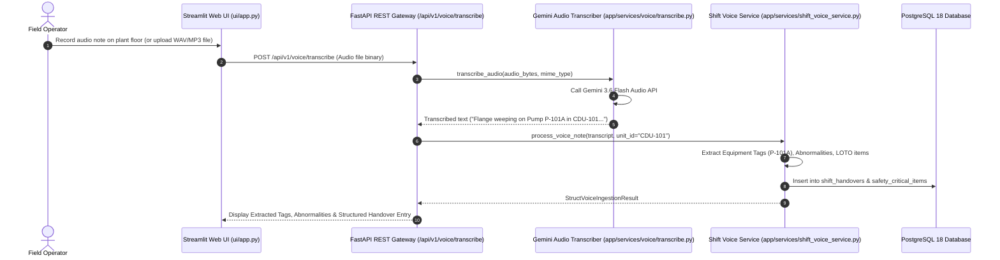

# Gemini Audio Voice Transcription & Field Voice Note Ingestion Engine

## 1. Overview

In chemical plants and oil refineries, field operators often record verbal shift handover updates while inspecting physical equipment on the plant floor. 

The **Gemini Audio Voice Transcriber & Ingestion Subsystem** ([`app/services/voice/transcribe.py`](file:///d:/Chatboat/app/services/voice/transcribe.py) and [`app/services/shift_voice_service.py`](file:///d:/Chatboat/app/services/shift_voice_service.py)) provides automated speech-to-text transcription and structured NLP extraction to convert raw voice notes into formal database shift handover logs.

---

## 2. Architecture & Ingestion Flow



---

## 3. Core Components & Technical Details

### 3.1 `GeminiAudioTranscriber` ([`app/services/voice/transcribe.py`](file:///d:/Chatboat/app/services/voice/transcribe.py))
- **Primary Engine**: Google Gemini 3.6 Flash (`gemini-3.6-flash`).
- **Supported File Formats**: `.wav`, `.mp3`, `.m4a`, `.ogg`, `.flac`, `.webm`.
- **API Method**: `transcribe_audio(audio_bytes: bytes, mime_type: str = "audio/wav") -> str`.
- **Fallback Resilience**: Returns empty string gracefully if audio input is corrupt or missing, logging detailed diagnostics without crashing the application.

```python
# app/services/voice/transcribe.py
from app.services.voice.transcribe import gemini_voice_transcriber

transcript = gemini_voice_transcriber.transcribe_audio(audio_data, mime_type="audio/wav")
```

---

### 3.2 `ShiftVoiceIngestionService` ([`app/services/shift_voice_service.py`](file:///d:/Chatboat/app/services/shift_voice_service.py))
Parses unstructured audio transcripts using regex patterns and LLM extraction to populate structured handover entities:
- **Equipment Tags Extracted**: Regex matching ISA-5.1 tags (`P-101A`, `CDU-101`, `C-101`, `V-202`, `E-301`).
- **Abnormalities Detected**: Keyword matching (`weeping`, `leak`, `vibration`, `high temp`, `tripped`).
- **LOTO / Work Permits**: Detects Lockout/Tagout IDs (`LOTO-101`, `PTW-402`).

```python
# Result Data Transfer Object
class StructVoiceIngestionResult(BaseModel):
    unit_id: str
    transcript: str
    extracted_equipment_tags: List[str]
    extracted_abnormalities: List[str]
    extracted_loto_items: List[str]
    summary_message: str
    handover_id: Optional[str]
```

---

## 4. End-to-End Field Verification Example

1. **Operator Input**: Verbal voice note recorded via Streamlit UI microphone widget:
   > *"Unit CDU-101 handover update: Pump P-101A mechanical seal is weeping 5 drops per minute. LOTO tag LOTO-882 applied. Check startup SOP for P-101B."*
2. **Gemini Audio Transcription**: Transcribes audio to exact text.
3. **Structured Database Ingestion**:
   - `unit_id`: `CDU-101`
   - `extracted_equipment_tags`: `["P-101A", "P-101B"]`
   - `extracted_loto_items`: `["LOTO-882"]`
   - `abnormalities`: `["mechanical seal weeping"]`
4. **P2P Delegation**: Automatically delegates SOP retrieval to `qa_technical_agent` for `P-101B` startup procedures!
