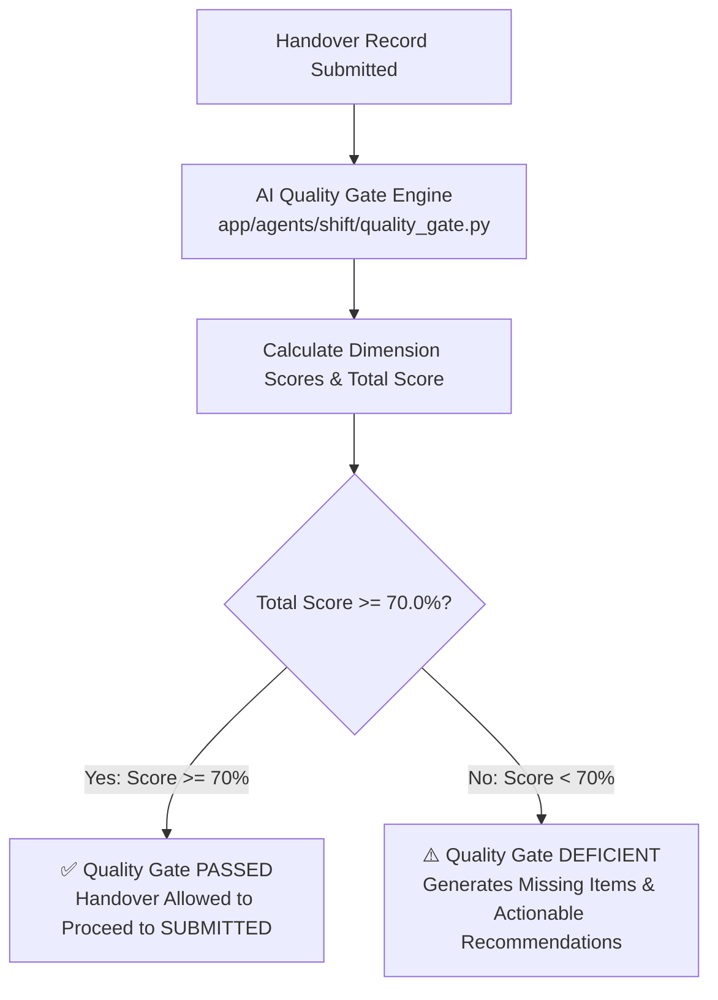

# AI Quality Gate & Completeness Scoring Engine

## 1. Overview

Shift handovers in process industries must contain complete, accurate, and safety-critical information. Incomplete handovers are a primary cause of industrial plant accidents.

The **AI Quality Gate & Completeness Scoring Engine** ([`app/agents/shift/quality_gate.py`](file:///d:/Chatboat/app/agents/shift/quality_gate.py)) evaluates shift handover log quality on a **0.0% to 100.0% scale** across 4 operational dimensions before allowing submission or supervisor approval.

---

## 2. Quality Gate Dimensions & Scoring Formula

The Quality Gate evaluates handovers across 4 mandatory dimensions (25.0 points max per dimension):

| Dimension | Max Weight | Evaluation Criteria |
| :--- | :---: | :--- |
| **1. Operational Summary** | **25.0 pts** | Clear narrative of shift activities, unit throughput, and active operational targets. |
| **2. Safety Critical Items** | **25.0 pts** | Documented Lockout/Tagout (LOTO) isolation, ESD bypasses, and active work permits. |
| **3. Equipment Status** | **25.0 pts** | Active equipment abnormalities, pump/compressor trips, and maintenance status. |
| **4. Work Permits & Actions** | **25.0 pts** | Open Hot Work / Cold Work permits and mandatory action items for the incoming shift. |

$$\text{Overall Score (\%)} = \sum_{i=1}^{4} \text{Dimension Score}_i$$

---

## 3. Decision Thresholds & Passing Policy



- **Passing Threshold**: **`70.0%`**
- **Passing Status**: Handover is marked `is_passing = True`.
- **Deficient Status**: If total score is `< 70.0%`, the Quality Gate returns `is_passing = False`, along with an explicit list of **Missing Items** and **Actionable Recommendations**.

---

## 4. Code Contract & Data Model

### 4.1 `ShiftHandoverQualityReport` ([`app/agents/shift/quality_gate.py`](file:///d:/Chatboat/app/agents/shift/quality_gate.py))

```python
class ShiftHandoverQualityReport(BaseModel):
    handover_id: str
    overall_score: float = Field(..., ge=0.0, le=100.0)
    passing_threshold: float = 70.0
    is_passing: bool
    dimension_scores: Dict[str, float]
    missing_items: List[str]
    recommendations: List[str]
    evaluated_at: float
```

---

## 5. Usage & Workflow Integration

The Quality Gate can be invoked manually by an operator or automatically during the shift handover lifecycle:

```python
from app.agents.shift.quality_gate import shift_quality_gate

# Evaluate a shift handover dictionary
report = shift_quality_gate.evaluate(handover_data, handover_id="SHO-2026-001")

print(f"Quality Score: {report.overall_score}%")
print(f"Is Passing: {report.is_passing}")
for rec in report.recommendations:
    print(f"- Recommendation: {rec}")
```

---

## 6. Real-World Operator Experience in Streamlit UI

In the **Streamlit Web UI** (`ui/app.py`), operators can click **"Run AI Quality Check"** to visualize:
- 📊 **KPI Meter Card**: Interactive score badge (e.g. `85.0% - PASSED`).
- 📈 **Dimension Breakdown Bars**: Visual representation of scores across Summary, Safety, Equipment, and Permits.
- 💡 **Actionable Recommendations**: Bulleted list guiding the operator on what specific missing details to add before handing over to the incoming shift.
