# Bidirectional Peer-to-Peer (P2P) Agent Communication Protocol

## 1. Overview

The **Peer-to-Peer (P2P) Agent Communication Protocol** ([`app/agents/p2p.py`](file:///d:/Chatboat/app/agents/p2p.py)) enables autonomous multi-turn dialog and state exchange between active agents in the MASS platform (`shift_handover_agent` and `qa_technical_agent`).

Unlike traditional static one-way handoffs, P2P communication enables:
- **Bidirectional Dialogue**: Agents send requests, ask follow-up questions, and provide clarifications across multiple turns.
- **Shared Live State Payload**: A mutable dictionary (`shared_state`) is passed back and forth, allowing both agents to update shared facts in real time.
- **Consensus & Resolution**: The P2P channel remains open until both agents reach explicit consensus or max turns are exhausted.

---

## 2. P2P Subsystem Architecture

```mermaid
sequenceDiagram
    autonumber
    actor Operator as Console Operator / UI
    participant Orch as Agent Orchestrator
    participant P2P as P2P Channel (app/agents/p2p.py)
    participant Shift as Shift Handover Agent
    participant QA as QA Technical Agent
    participant DB as PostgreSQL 18 DB
    participant Vector as Qdrant Cloud (mass_qa_multimodal)

    Operator->>Orch: "Record vibration on C-101 for Unit CDU-101 and fetch startup SOP"
    Orch->>P2P: p2p_negotiate(shift_agent, qa_agent)

    rect rgb(30, 40, 60)
        note over P2P, QA: Turn 1: Initial Peer Handoff
        Shift->>P2P: Send Operational Request + State (Unit: CDU-101, Equipment: C-101)
        P2P->>QA: Dispatch Operational Context to QA Technical Agent
    end

    rect rgb(40, 50, 70)
        note over QA, Vector: Turn 2: RAG Technical Retrieval & Knowledge Handoff
        QA->>Vector: Hybrid Search for SOP-101 & Equipment Specifications
        QA-->>P2P: Return Technical SOP Guidance + Document Citations
        P2P-->>Shift: Update Shared State with Technical SOP Payload
    end

    rect rgb(50, 60, 80)
        note over Shift, DB: Turn 3 & 4: Database Persistence & Consensus
        Shift->>DB: Write Shift Handover Record + Equipment State to PostgreSQL
        Shift->>P2P: Confirm Consensus & Construct Composite Response
    end

    P2P->>Orch: Return Unified P2P AgentResult + Dialogue Transcript
    Orch->>Operator: Display Shift Note + Technical SOP + P2P Transcript
```



---

## 3. Data Contracts & Data Transfer Objects

### 3.1 `P2PMessage` Frame ([`app/agents/p2p.py`](file:///d:/Chatboat/app/agents/p2p.py#L10))
```python
class P2PMessage(BaseModel):
    message_id: str
    sender_agent_id: str
    receiver_agent_id: str
    turn: int
    intent: str = "PEER_EXCHANGE"
    content: str
    shared_state: Dict[str, Any]
    timestamp: float
```

### 3.2 `P2PSessionState` ([`app/agents/p2p.py`](file:///d:/Chatboat/app/agents/p2p.py#L25))
```python
class P2PSessionState(BaseModel):
    session_id: str
    initiator_agent_id: str
    partner_agent_id: str
    max_turns: int = 4
    current_turn: int = 0
    messages: List[P2PMessage]
    shared_data: Dict[str, Any]
    consensus_reached: bool = False
    final_summary: str = ""
```

---

## 4. Execution API (`p2p_negotiate`)

The entrypoint function [`p2p_negotiate()`](file:///d:/Chatboat/app/agents/p2p.py#L78) executes the bidirectional P2P channel:

```python
from app.agents import p2p_negotiate, AgentRequest, RequestContext

result = p2p_negotiate(
    agent_a_id="shift_handover_agent",
    agent_b_id="qa_technical_agent",
    initial_request=request,
    context=context,
    max_turns=4
)
```

---

## 5. Summary of P2P System Benefits

1. 🔄 **True Bidirectional Handoff**: No single agent is isolated; peers converse to exchange facts.
2. 🔒 **Deadlock Protection**: Hard limit of `max_turns=4` guarantees sub-second execution without infinite recursion loops.
3. 📜 **Full Auditability**: The exact turn-by-turn P2P dialogue transcript is embedded directly into `AgentResult.metadata["a2a_trace"]`.
