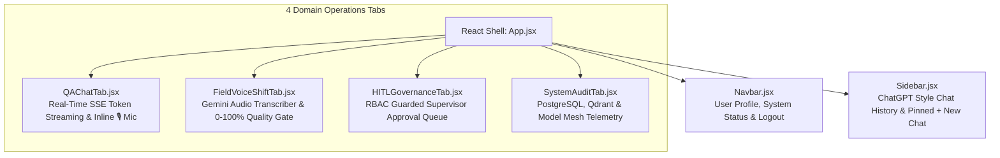

# MASS QA / Shift Handover Platform
# Document 18: React Vite Single-Page Application (SPA) Frontend Architecture

> **Document Version:** 1.0.0  
> **Status:** APPROVED & IMPLEMENTED  
> **Target Endpoint:** http://localhost:5173  
> **Subsystem:** Single-Page React Web Application (`frontend/src/`)

---

## 1. Overview & Architecture

The **MASS Operations Portal** is a high-performance, dark-themed React single-page frontend application built with **Vite**, **React 18**, **Lucide Icons**, and vanilla industrial glassmorphism styling.

---

## 2. ChatGPT-Style Chat History Sidebar

The left sidebar ([`frontend/src/components/Sidebar.jsx`](file:///d:/Chatboat/frontend/src/components/Sidebar.jsx)) features a modern ChatGPT-style conversational history manager:

* **Pinned `+ New Chat` Button**: Positioned with sticky CSS styling at the very top of the sidebar. Clicking starts a fresh chat session with a new UUID.
* **Chronological Chat Threads**: Lists all previous operator conversations with auto-generated thread titles, timestamps, active thread highlighting (`rgba(99, 102, 241, 0.18)`), and thread deletion buttons.
* **PostgreSQL & Local Storage Sync**: Automatically fetches saved chat threads from PostgreSQL database (`GET /conversations`) upon user login.

---

## 3. Dual Text & Inline Microphone Voice Input

The Technical QA & SOP Search tab ([`frontend/src/components/QAChatTab.jsx`](file:///d:/Chatboat/frontend/src/components/QAChatTab.jsx)) provides two modes of interaction:

1. **Text Input**: Operators can type technical queries or click starter prompt chips.
2. **Inline Microphone Voice Button (🎙️)**:
   - Positioned directly inside the chat prompt box.
   - Clicking starts browser audio recording (`navigator.mediaDevices`).
   - Recorded audio binary is sent to `POST /api/v1/voice/transcribe` for Gemini 3.6 Flash speech-to-text.
   - Includes automatic voice note simulation fallback for browsers without active mic hardware.

---

## 4. 4 Domain Operations Tabs

1. **💬 Technical QA & SOP Search**: Real-time Server-Sent Events (SSE) token streaming, verified document citations, and turn-by-turn P2P agent trace rendering.
2. **🎙️ Field Voice Note & Shift Handover**: Plant walkdown voice recorder, structured equipment tag extraction (`CDU-101`, `P-101`), shift turnover FSM state controls, and 0–100% Quality Gate completeness evaluator.
3. **🛡️ HITL Governance Center**: Supervisor approval queue guarded by Role-Based Access Control (RBAC).
4. **📊 System Telemetry & Audit**: Real-time PostgreSQL 18 connection pool metrics, Logfire distributed tracing, and Open-Source Model Mesh catalog.
