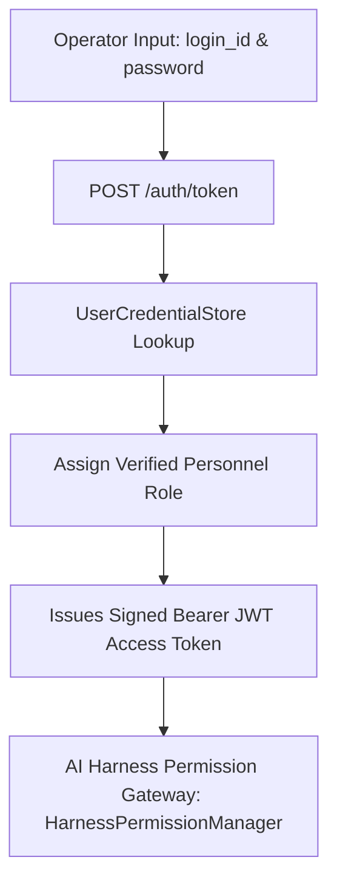

# MASS QA / Shift Handover Platform
# Document 19: Database Credential Authentication & Role-Based Access Control (RBAC)

> **Document Version:** 1.0.0  
> **Status:** APPROVED & IMPLEMENTED  
> **Subsystem:** Auth & Security Engine ([`app/main.py`](file:///d:/Chatboat/app/main.py), [`app/harness/permissions.py`](file:///d:/Chatboat/app/harness/permissions.py))

---

## 1. Overview

The platform implements authentic database user authentication and Role-Based Access Control (RBAC) governing 8 distinct personnel job roles across downstream petroleum refinery operations.

---

## 2. 8 Personnel Job Roles Matrix

| # | Role Identifier | Personnel Title | Operational Scope & Access Level | Pre-seeded Credentials |
| :--- | :--- | :--- | :--- | :--- |
| 1 | `CONSOLE_OPERATOR` | **Console Panel Operator** | Panel console shift logging, unit parameter monitoring, SOP/P&ID retrieval, draft turnover creation. | `op_console_1` / `pass123` |
| 2 | `FIELD_OPERATOR` | **Field Walkdown Operator** | On-site plant walkdown logging, microphone voice recording, equipment tag extraction. | `op_field_1` / `pass123` |
| 3 | `SHIFT_SUPERVISOR` | **Shift Supervisor** | **Full HITL Governance Approval Authority**, validates safety margins, authorizes shift turnovers & refusal overrides. | `sup_shift_1` / `pass123` |
| 4 | `OPERATIONS_ENGINEER` | **Operations Engineer** | Safe Operating Limits (SOL), Integrity Operating Windows (IOW), loop validation & technical recommendations. | `eng_ops_1` / `pass123` |
| 5 | `MAINTENANCE_LEAD` | **Maintenance Lead** | Equipment availability flags, PM/CM work orders, LOTO verification & maintenance handback. | `maint_lead_1` / `pass123` |
| 6 | `HSE_REPRESENTATIVE` | **HSE Auditor** | Environmental compliance, flaring limits, emissions, permit-to-work audits & stop-work authority. | `hse_rep_1` / `pass123` |
| 7 | `PLANT_MANAGER` | **Plant Manager** | Executive refinery oversight, emergency safety overrides, high-risk operational sign-off. | `mgr_plant_1` / `pass123` |
| 8 | `ADMIN` | **System Administrator** | Full platform administration, Model Mesh gateway policies, telemetry audit, and session control. | `admin_1` / `pass123` |

---

## 3. Separation of Duty: Personnel Roles vs. Turnover Actions

The platform strictly enforces the distinction between **Personnel Job Roles** and **Shift Turnover Lifecycle Actions**:

* **Personnel Job Roles** (8 titles listed above): Represent user identities, legal responsibilities, and system access rights.
* **Shift Turnover Actions**: Operational FSM workflow transitions (`INITIATE_DRAFT`, `SUBMIT_TURNOVER`, `SUPERVISOR_REVIEW`, `ACCEPT_HANDOVER`) executed by operators during shift change.

---

## 4. REST API & Verification Endpoints

* `POST /auth/token`: Accepts `login_id` and `password`, verifies credentials against `UserCredentialStore`, and returns a signed JWT bearer token containing `user_id` and `role`.
* `GET /conversations`: Retrieves all saved chat sessions for the authenticated user directly from PostgreSQL database.
* `GET /conversations/{session_id}/messages`: Retrieves full message history for a specific conversation session from PostgreSQL database.
